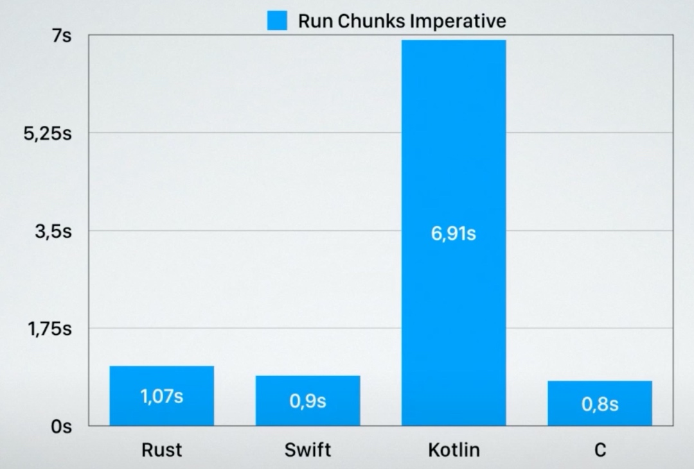

# 客户端跨平台语言方案调研
- [客户端跨平台语言方案调研](#客户端跨平台语言方案调研)
  - [为什么需要跨平台语言](#为什么需要跨平台语言)
  - [方案对比](#方案对比)
    - [优势](#优势)
    - [劣势](#劣势)
  - [开发人员相关](#开发人员相关)
  - [Q\&A](#qa)
    - [Q1. 由于rust本身没有完整的OO，对现有开发人员需要面临的编程思想转变如何解决](#q1-由于rust本身没有完整的oo对现有开发人员需要面临的编程思想转变如何解决)
    - [Q2. rust 语言本身的学习成本](#q2-rust-语言本身的学习成本)
    - [Q3. 冷门组件没有rust版本的问题](#q3-冷门组件没有rust版本的问题)
    - [Q4. rust 语言代码管理，代码规范问题](#q4-rust-语言代码管理代码规范问题)
      - [1. 开发过程](#1-开发过程)
      - [2. Workflow](#2-workflow)
      - [3. 缺陷拦截](#3-缺陷拦截)
    - [Q5. 如何解决 rust 对复杂数据结构不支持的问题](#q5-如何解决-rust-对复杂数据结构不支持的问题)
    - [Q6. 常用基础库可能不完整，需要调研下现在不支持的功能（比如网络IO、磁盘IO）](#q6-常用基础库可能不完整需要调研下现在不支持的功能比如网络io磁盘io)
  - [性能对比](#性能对比)
    - [测试平台与对比语言](#测试平台与对比语言)
    - [测试1](#测试1)
    - [测试2](#测试2)
  - [汇总表格](#汇总表格)
- [参考资料](#参考资料)

## 为什么需要跨平台语言
目前业界常见的跨平台方案主要分为三种：桥接、进程间通信、canvas绘制。而这些解决方案着眼点都是如何用更少的代码能够做出高效统一接近原生的UI。

但这些方案都无法解决非UI层的业务逻辑代码如何安排的问题。如果用跟UI层一样的语言，则无法保证运行时效率；如果不用UI层的语言编写，而使用native层的语言，那带来的效率提升将极其有限，甚至反而造成更高的复杂度。事实上，大量的业务逻辑用JS/Dart这样的语言并不合适，随着业务迭代，往往到最后还是iOS写一部分、Android写一部分，然后使用桥接器做接口。

除此之外，这些方案还都忽略了一个重要的问题：如今 app 变得越来越复杂，复杂的不仅仅是 UI，还有业务逻辑。业务逻辑支撑着 UI，如何在所有平台上尽可能小代价地做出统一的业务逻辑，是一个比如何做出统一的 UI 更值得关注的问题。

那么如何在所有平台上尽可能小代价地做出统一的业务逻辑？比如你要在 app 里支持一套非标准的加密算法，只有两个选择：
1. 用各个平台的原生语言各自实现一套，要保证所有的实现都是一致的，并且以后升级，每个平台都需要相应更新。
2. 用C/C++/Rust等跨平台语言实现一次，然后在各个端上用静态链接的方式编译到 app 中。当然，这免不了要做很薄的一层接口：每个平台原生语言到C/C++/Rust的桥接。

一般而言，有实力有工程师资源的公司会选择第二种，因为它是一劳永逸的方案：一开始的工作量不少，各个平台的桥接代码开发起来很痛苦，但一旦成型，以后的升级就顺滑很多。

在平台化战略的要求下，我们需要将客户端的业务逻辑进行对齐，摒除平台差异的同时还要提高可维护性与开发效率。在这样的要求下，如果还直接使用纯UI层的跨平台框架将难以在长期保持逻辑一致性与总体架构不偏离。因此我们大前端在技术架构演进上选择了向代码一致的方向推进。

## 方案对比
那么有哪些语言可以在保持整体性能的前提下，实现大前端跨端呢？目前业界提供的方案只有两种：C/C++与Rust。

在Rust成熟以前，C/C++ 几乎是跨端做业务逻辑的唯一的选择。C/C++虽然有着历史悠久、积淀深厚、支持范围够广等优势，但是问题也很明显：C/C++ 的代码（相对于java/kotlin/swift来说）很难写，同时有很多依赖管理，跨平台编译链接有很多坑要踩。就算实现了业务逻辑本身，在并发环境下，异步环境下，还是可能会产生无穷无尽的内存安全或者并发安全的bug。最终的结果是代码的维护成本越来越高，让`一次撰写，到处链接`的好处最终变成灾难。这也是一般的 app 开发团队不敢去碰的一个重要原因，甚至，有些成熟的且有复杂业务逻辑的团队（如 dropbox）碰了之后又黯然弃坑的重要原因。

### 优势

而现在我们有了越来越成熟的Rust，工具不再是障碍：
1. Rust有不输于任何一门现代语言的优秀抽象能力
2. Rust安全性非常高，在不使用unsafe模式下不会出现任何内存泄漏
3. Rust性能与C/C++几乎没有区别，同样具有0抽象开销能力
4. Rust有非常优秀的依赖管理
5. Rust的开源库由于语言自身特性，对编译器的代码检查非常严格，因此开源生态非常优秀
6. Rust有非常完备的跨平台编译系统和跨语言FFI支持
7. Rust本身不依赖运行时的内存安全和并发安全性，运行环境完全由LLVM提供
8. 最好的WebAssembly支持
9. iOS提供了cargo lipo简化了与OC/Swift的互操作
10. Android提供了专门的android-ndk-rs作为ndk工具

### 劣势

这些优势使其成为理论上跨平台底层技术栈和编程语言的最佳选择。但Rust也并非十全十美，以下几个问题影响了Rust的推广难度：
1. 语言特性复杂，对新手不够友好，学习曲线比带GC/runtime和无安全检查的语言要陡峭
2. 语言演进以社区主导，虽然在1.0之后语法稳定，但是新的特性功能迭代频繁，需要持续学习跟进
3. 第三方库的成熟度不如老牌语言，一些冷门功能性组件轮子较少

综上所述，是否采用最关键的一个问题：是否能找到合适的Rust工程师。

## 开发人员相关
与人员相关主要包含内部培养跟外部招聘。
内部培养的话Rust的语言上手难度大概在C++与Swift/Kotlin之间，对于客户端开发来说，难点主要是异步处理、并发安全、类型系统及泛型编程上，但总体难度会比多范式的C++低很多。根据客户端内部的使用意见，相较于C++几乎全部都更愿意使用Rust。
外部招聘的话难度则相对较高，Rust在国内毕竟相对冷门，从业人员更多集中在区块链等行业，大型企业招聘Rust以字节等公司为主。不过对于熟悉C++技术栈的同学来说，转为Rust开发并不困难。

## Q&A
### Q1. 由于rust本身没有完整的OO，对现有开发人员需要面临的编程思想转变如何解决
首先Rust并不是没有OO，而是与Java/OC等语言的OO实现机制不同。
OO主要包含三大特性封装(对象、类)、多态(继承)、消息传递（函数调用）,而Rust其实这些都包含。
其中封装上Rust与其他语言的区别主要在于：传统的类结构同时包含了数据与行为；而Rust中的“类”则被拆分为结构体(struct)与特质体(trait)两部分组成，并加强了枚举(enum)的能力，其中struct提供数据，trait提供行为，enum则用于处理同一类型的分类数据和行为，相当于将传统的class结构进行了拆分。通过这样的拆分使得原本容易混杂数据模型(model)跟操作行为(function)的类结构变的职责更加分明，这其实从代码管理的角度来说是一件好事，只是需要一定的学习使用成本。
Rust与传统语言在面向对象上的区别主要在于：传统OO里面多态是运行时多态，一般是通过继承来实现的，即通过继承来实现类型系统与代码共享；而Rust则是通过泛型（generic）+特质（trait）这种编译期多态来实现多态。从具体实现上来说，与其他OOP语言在能力覆盖和抽象能力上并没有区别。相对于传统OO的继承实现方式，Rust只不过将数据复用、方法复用、多态能力等全部进行了解藕，使得其每一个部分都能单独拿出来复用。
而在Rust中消息传递也是基于函数调用实现的，这一点上与其他的静态语言并无区别。但是Rust为了最大程度的节省空间，并没有使用C++的vtable机制，因此放弃了运行时多态能力，而是通过胖指针来实现编译期多态：如果只定义struct，内存布局上是没有vptr的，只有当你真正使用trait对象的时候才会生成vptr。
在Rust中
* 通过struct抽象数据，语法是
    ```rust
    struct Data {}
    ```
* 通过为struct 提供实现抽象行为，语法是
    ```rust
    impl Data { 
        fn method() {
            // do something...
        } 
    }
    ```
* 通过是否公开数据和行为来控制封装细节：
    ```rust
    pub struct Data { 
        pub no: u32
    }
    impl Data {
        pub fn new() -> Data {
            Data { no:0 }
        }
    }
    ```
* 通过泛型抽象不同类型：
    ```rust
    fn test<T>(t:T) {
    }
    ```
* 通过trait抽象类型必须拥有的能力：
    ```rust
    trait Echo {
        fn echo();
    }
    
    impl Echo for Data {
        fn echo() {
        }
    }
    
    fn test<T>(t:T) where T:Echo {
    }
    ```
综上所述，Rust不包含继承本身并不是问题，都可以通过组合手段来解决，但是编程思路需要进行转换。而思路的转换没有太多捷径，不过好在Rust给出的编译期提示够多，同时多加练习，写多了思路自然会跟随着一起改变。

### Q2. rust 语言本身的学习成本
Rust的学习成本确实相对大多数语言会高一些，但是也没有那么高到令人望而却步：
首先，Rust是一门现代语言，其语法规则与大部分具有函数式跟泛型能力的语言相差无几；其次，Rust相比其他语言，它的编程范式并不多，基本就固定一种写法，在Rust中的FP、OOP等各种编程范式被有机的融合到了一起，而不是固定的遵守某一个已有编程范式；最后Rust的语法糖其实并不多，不如说反而偏少，Rust社区对于语法糖的在标准库和默认编译选项上的开启是非常谨慎的，许多功能都需要主动声明才能使用。
总的来说，Rust的学习难度主要是两点：类型系统与常规设计有区别导致一些概念性思维需要转变、Rust的一些语法设计如果需要完全理解需要深入语言本身实现上。
其中第一点主要体现在所有权机制跟struct/trait/enum上；第二点主要体现在例如tokio这样偏低层的基础库上。不过由于Rust的核心开发者与Swift开发组之间的一些联系，Rust在除了安全编程（类型系统与所有权机制等）方面有比较大的区别，大部分语法跟设计思路与Swift非常接近。
综上所述，Rust的语言本身的学习成本确实相对较高，但是相比起C++来说还是简单很多的。而且跟Swift的设计理念高度接近，上手难度也不算高，难点主要还是在于深入理解Rust的底层机制上。我认为学习难度这一点不算非常大的阻碍。

### Q3. 冷门组件没有rust版本的问题
Rust毕竟是一门比较新的语言，一些冷门组件缺乏Rust版本是很正常的事情。不过这问题我们可以从三个方面来解释：
1. 对于客户端来说，绝大多数情况下不会涉及到特别冷门的组件
2. 冷门组件本身也很难被我们使用到生产环境中
3. 如果必须使用，简单的可以考虑自己造轮子，复杂的可以使用其他语言的库，然后通过Unsafe Rust做包装

其中第三点，使用Unsafe Rust并不一定代表着不安全，而是反过来，safe表示绝对安全。Unsafe更多的是标记这个功能Rust编译器无法验证他的安全性，但是程序员/代码提供者提供安全保证，以绕过一些编译器检查。实际上很多成熟的C/C++库的安全性也是通过长期积累而有所保证的。Rust通过Unsafe语义去调用这些库并不会对整体程序的安全性进行破坏，反而通过显示的标注，可以让人更加明确哪些代码模块是没用通过编译器进行安全保证的。并且Rust中的Unsafe有着明显的独有作用域，并不会对Safe代码产生入侵，因此合理使用Unsafe并不是一件坏事。

### Q4. rust 语言代码管理，代码规范问题
Rust 除了提供一套完整的工具链外，还具有一个称为 Cargo 的构建系统和软件包管理器。Cargo 处理许多任务，例如构建代码、下载库或依赖项等等。

对于代码管理、代码规范等相关问题从以下三个方面进行调研：

- 开发过程
- Workflow
- 缺陷拦截

#### 1. 开发过程

- **项目**：项目统一使用cargo 创建，对项目结构有固定的规范。同时也支持 workspace。

- **语法**：在语法层面的问题，比如对某些语法点不太熟悉，以及使用一些不常用的语法时，产生缺陷。Rust 提供了 `Rust Language Server ` 和`Rust Analyzer` 在编写代码过程中，及时报告语法错误。

- **类型安全**：Rust 时强类型语言，不允许类型的隐式转换。同时在检查时，使用了静态类型系统，在编译期保证类型正确。配合`Rust Analyzer`可以实时检测，不用等到 `cargo build`时

- **内存、资源安全、并发安全**：比如在 OC 发生数据竞争，编译器无法检测到。只有在运行时偶现触发，导致异常。但在 Rust 中，有所有权 / 借用检查 / 生命周期 / 类型系统 基本上能解决主要的内存和资源安全问题

- **错误处理**：Rust 使用 `Rust<T, E>`类型来包装错误的类型安全，强制必须处理这个类型返回的值，避免开发者丢弃。比如调用某一方法，只 if 处理了 success，并没有写 else 的 逻辑，大多数语音是没有强制开发者要处理的。但在 Rust 中 Error 是必须要处理的。

- **代码风格和常见错误**：Rust 内置`cargo fmt` 和 `cargo clipp`来统一代码风格和避免常见的开发错误，可以配置为在保存文件时自动格式化，或 Commit 时增加 Git Hook 触发

- **语言和编译器无法帮助解决的缺陷**：Rust 提供了单元测试和集成测试并规范组织测试代码以解决代码正确性问题：

  - **单元测试** - 的模块和待测试的代码在同一个文件中，且可以很方便地对私有函数进行测试
  - **集成测试** - 文件放在项目根目录下的 `tests` 目录中，由于该目录下每个文件都是一个包，我们必须要引入待测试的代码到当前包的作用域中，才能进行测试，正因为此，集成测试只能对声明为 `pub` 的 API 进行测试

- **关于`unsafe rust`**

  - 通常 unsafe 是在追求性能的过程中使用的，理的评估情况，在保持原有速度或者更快的时候，就应该继续使用 `safe` 版本的代码

  - 与其他语言交互 C、C++ 部分需要 unsafe 操作

  - 常规功能限制 unsafe 的使用，可以在 commit 和 CI 上 进行检测

  - 封装 unsafe 操作，提供一个安全抽象，给开发者使用。这也是在 Linux 内核中使用 Rust ，采用一个理念

  - 若要新增 unsafe 功能，必须 Review 无误后加入 unsafe 封装组件

  - 编写 unsafe rust 可用的检查工具：

    - Miri 是 `Rustc` 的 MIR (中级中间语言)，这是 Rust 在移交给 `LLVM` 或者`Cranelift`之前用来优化程序的中间表示，是一种解释器。 ` cargo miri test` 将在解释器中运行测试。 Miri 采用了很多可以检测未定义行为的技术，例如访问未初始化的数据，并会指出问题所在。 但是，它只会在被执行的代码上检测未定义行为，因此不能完整的覆盖代码。

    - Clippy and Rust lints：Rust的官方 lints (静态分析工具) 中有很多对编写 `unsafe` 有帮助的 lint

    - Prusti：仍在开发中（目前在更新到最新的稳定Rust时存在一些问题，因此最新的稳定版本针对某些2018 Rust编译器），但是这个工具非常有前景，可让你在数学上验证给定特定条件的代码的安全性。

      基本上，你可以用数学证明代码中某些不变量是 "真的" 保持不变的，这对于必须支持不安全代码的不变量的安全抽象是理想的。

    - Fuzzers：[Rust Fuzz Book](https://rust-fuzz.github.io/book/) 列出了许多可与Rust一起使用的 `Fuzzer` (模糊测试器)。将为的代码创建大量的测试输入，并运行它以查找触发崩溃的某种组合。

- **基准测试 benchmark**：在 Rust 中有两种方式可以实现：1. 官方提供的`benchmark`；2. 社区实现，如`criterion.rs`

- **三方组件授权**：可以使用`cargo-deny`来确保使用的第三方依赖没有不该出现的授权（比如不使用任何 GPL/APGL 的代码）、没有可疑的来源（比如不是来自某个 fork 的 GitHub repo 下的 commit），以及没有包含有安全漏洞的版本。使用 `cargo-deny`可以自动避免很多有风险的第三方库

- **可执行文件大小**：绝大多数场景使用`crago build --release`就够了，除非特殊情况，要使可执行文件尽可能小，可以使用`min-sized-rust`来处理 。

#### 2. Workflow

- **代码仓库管理**：
  - 使用 Cargo 统一创建项目，统一功能组的组件可以使用 `workspace`管理组织。促使项目结构规范统一
  - 私有源：可以搭建自己的 crates 和 rustup 源 发布私有组件与官方隔离
  - 提交代码：可以配置 pre-commit 在 commit 时自动做一系列检查
- **测试和持续集成**：
  - 第一道：pre-commit，提交代码时本地检测
  - 第二道：提交 MR 时，在 GitLab Runner CI 跑静态检查、单元测试、集成测试等
- **文档**：在编写代码时，可以使用文档注释，使用官方工具自动生成

#### 3. 缺陷拦截

| 触发点                     | 响应        | 拦截工具                                               |
| -------------------------- | ----------- | ------------------------------------------------------ |
| 编写代码时                 | 即时        | `Rust Language Server ` 和`Rust Analyzer`              |
| 下次编译构建时             | 分钟        | 编译器                                                 |
| 提交代码时 Commit Git Hook | 分钟 / 小时 | Git Hook 触发 `fmt` 、 ` clipp`、单测等                |
| 提交 MR 后 CI 校验         | 小时        | CI 运行 `fmt`、`clipp`、unsafe 检查、 单测、集成测试等 |
| Code Review 时             | 小时 / 天   | 人工                                                   |

Rust 在设计之初，尽可能把大量缺陷在编译期，就检测出来，及时修改，不至于把缺陷带到后续环境，最大程度的保证代码质量。

这也是 Rust 上手难度大的原因之一，初学者前期需要和编译器做斗争，写出能编译通过的代码。同时也说明能够让代码编译通过，基本上代码的安全性没有太大问题

### Q5. 如何解决 rust 对复杂数据结构不支持的问题

从以上表格可以看出，Rust标准库内支持的数据结构是非常丰富的，绝大多数情况已经足够满足日常开发需要。另外Rust对自定义数据结构并不是无法做到，只是自己去实现一些特定的数据结构会有一些难度。

### Q6. 常用基础库可能不完整，需要调研下现在不支持的功能（比如网络IO、磁盘IO）
这里可以参考这篇文档[Rust生态之Rust语言及其三方库](mweblib://16469733009294)，根据这篇文档的调研成果可以得出以下结论：Rust的基础库建设已经基本完善，例如Rust也有类似Java NIO的MIO库，也有类似Java Future的Future（如下图所示）。

Rust提供的常用基础库和三方库生态可以满足我们的使用需求。

## 性能对比
### 测试平台与对比语言
* Mac mini 2018, 3.2GHz
* 习惯性编码，无针对性优化
* Kotlin Native 1.0.3
* Rust 1.32.0
* C++ Clang 6.0
### 测试1
测试方法：尝试对一个很大的包含各种数字的字符串进行切割，然后将其中小于100的数字的求和。


C++代码明显很多，Kotlin跟Rust代码接近，但性能却差几十倍：


### 测试2
一个Array chunking的函数，把数组切片，再切片，然后求和。


swift 代码我就不贴了。结果发现 Kotlin Native 运行的时候直接超时（可能是语言的bug）：


由于Kotlin的代码运行时间太长，影响了这个图的可对比性，移除 Kotlin 后，rust和C相差不大（20%），swift比rust差了一个量级：


如果把Swift和Kotlin代码从上面的简单易懂的函数式写法改成更加冗长的命令式代码（用forloop）后，性能一下子上来了，可见二者对函数式编程的支持还有很大改进的空间：




语言本身的能力之外，第三方库的效率如何？Benedikt benchmark了 Rust和Swift对JSON数据的处理：


二者有17倍的性能差距。所以，如果用 Rust 作为客户端来处理REST API，每次 API 的请求能够节省大量的时间，尤其是很大的JSON response。

在所有这些 benchmark 中，他还记录了内存使用情况：


在节约内存这块，Rust 是无可挑剔的王者。如果说 Swift / Kotlin 在编译器和第三方库上经过努力，还可以尽可能把和 Rust 的性能差距控制在一个量级之内，内存的占用，是很难优化的，它涉及到语言内部的实现细节。

所以，至少在这个阶段，Kotlin Native 还无法成为 Rust 在业务逻辑代码上跨端开发的一个有力竞争者。而且，我并不觉得它未来能够成为 Rust 在这块的竞争者。因为，没有多少 Kotlin 的开发者会严肃地开发高性能的第三方库，而 Rust 整个社区的氛围都是：更高，更快，更强。目前几乎所有新的算法和数据结构的出现，都会有对应的 Rust 的开源实现，而同样的 Kotlin 或者 Swift 的开源实现，则几乎要靠撞运气。

## 汇总表格
|--|C/C++|Rust|Swift|Kotlin-Native|
|--|-----|----|-----|-------------|
|运行速度|最快|很快|较慢|最慢|
|内存消耗|最低|很低|较大|最大|
|跨平台能力|优秀|优秀|一般|一般|
|安全能力|最低|优秀|良好|良好|
|依赖管理|较差|优秀|中等|良好|
|学习难度|难|较难|较难|普通|
|招聘难度|较难|困难|容易|容易|

# 参考资料
* [深度探索：前端中的后端](https://zhuanlan.zhihu.com/p/347842418)
* [深度分析：前端中的后端-实现篇](https://zhuanlan.zhihu.com/p/349423119)
* [Dart Meets Rust: a match made in heaven](https://dev.to/sunshine-chain/dart-meets-rust-a-match-made-in-heaven-9f5)
* [[Flutter翻译]Dart与Rust：天作之合](https://juejin.cn/post/7016876094242439205)
* [Rust + Flutter 高性能的跨端尝试](https://zhuanlan.zhihu.com/p/108308284)
* [flutter_rust_bridge](https://github.com/fzyzcjy/flutter_rust_bridge)
* [rust_on_mobile](https://github.com/Geal/rust_on_mobile)
* [Sharing Code between iOS & Android with Rust](https://speakerdeck.com/terhechte/sharing-code-between-ios-and-android-with-rust?slide=4)
