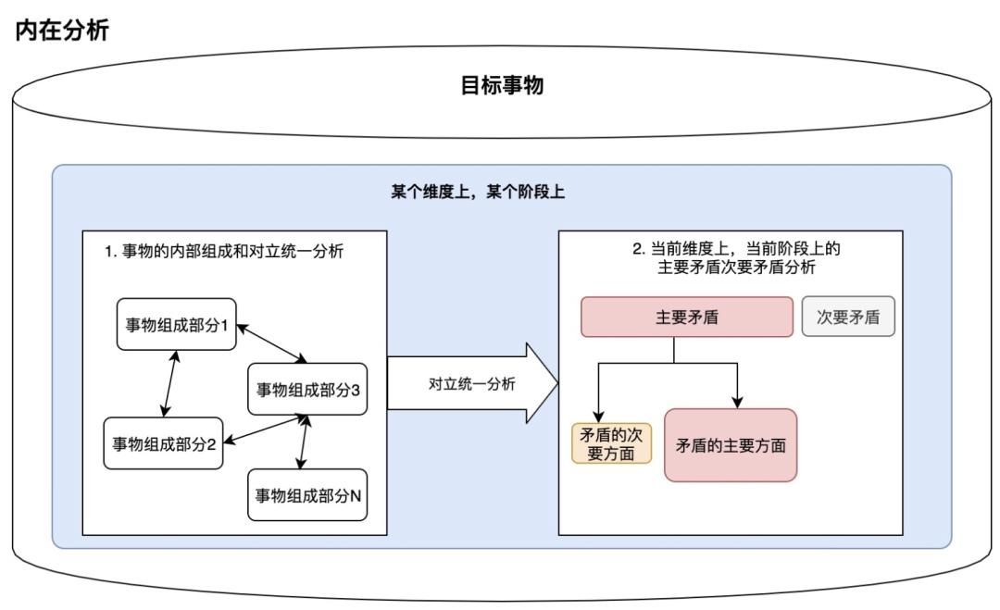
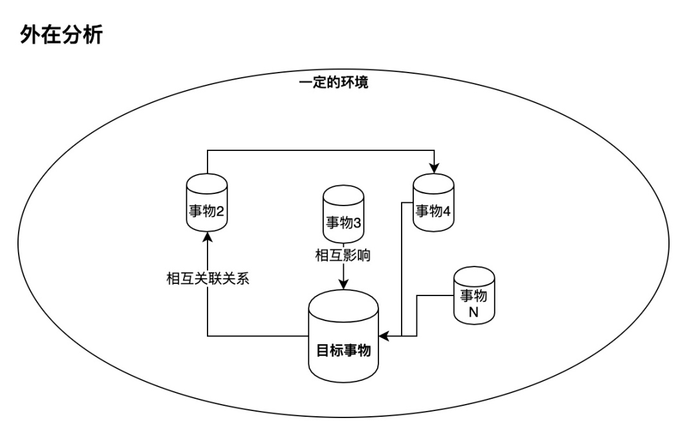
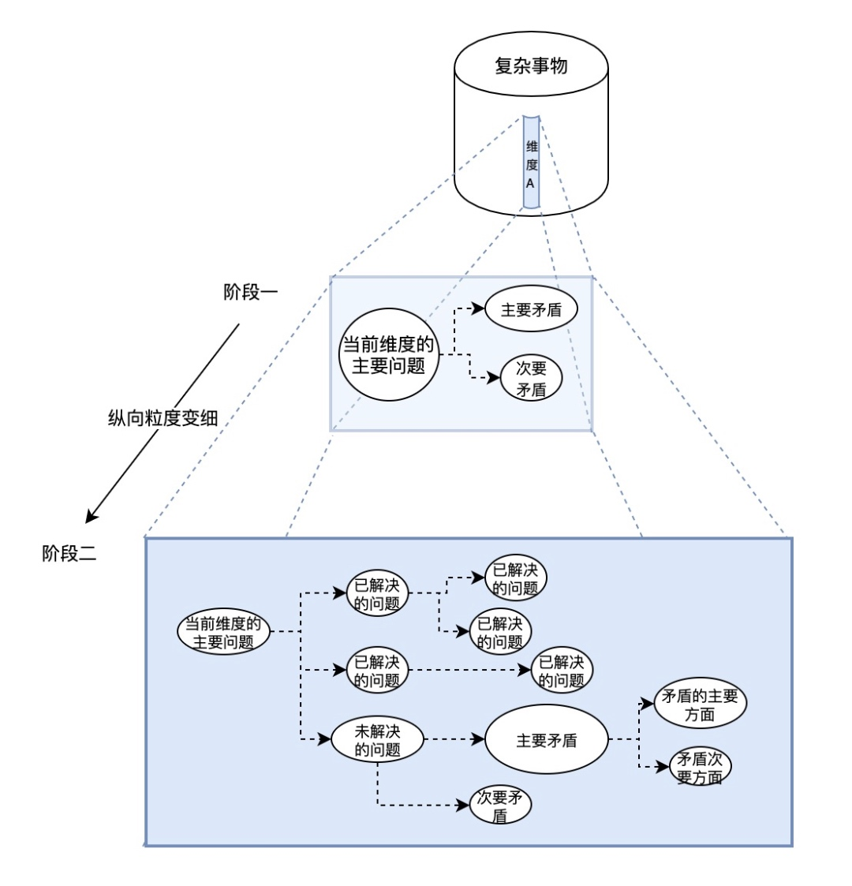

# 基于辩证法的架构设计

- [基于辩证法的架构设计](#基于辩证法的架构设计)
  - [前言](#前言)
  - [什么是软件架构](#什么是软件架构)
  - [架构师应该干什么](#架构师应该干什么)
  - [如何描绘整体蓝图](#如何描绘整体蓝图)
    - [架构方向与其性质](#架构方向与其性质)
  - [如何建立清晰的架构](#如何建立清晰的架构)
    - [如何分析架构本质](#如何分析架构本质)
    - [分析事物的步骤](#分析事物的步骤)
      - [内在分析](#内在分析)
        - [明确事物的讨论范围](#明确事物的讨论范围)
        - [分析事物内在与存在形式](#分析事物内在与存在形式)
        - [分析事物的内在各部分的职责](#分析事物的内在各部分的职责)
        - [分析各个职责下的核心诉求](#分析各个职责下的核心诉求)
      - [外在分析](#外在分析)
        - [事物的外部环境如何](#事物的外部环境如何)
        - [外部环境中的关键事件是什么](#外部环境中的关键事件是什么)
        - [关键事件对事物内部的影响是什么](#关键事件对事物内部的影响是什么)
        - [外部环境的变化趋势是什么](#外部环境的变化趋势是什么)
      - [合题分析](#合题分析)
        - [再次明确讨论范围和场景](#再次明确讨论范围和场景)
        - [确定矛盾普遍性与特殊性](#确定矛盾普遍性与特殊性)
        - [确定当前阶段主要矛盾次要矛盾](#确定当前阶段主要矛盾次要矛盾)
      - [基于当前阶段的矛盾，分析矛盾的主次方面](#基于当前阶段的矛盾分析矛盾的主次方面)
    - [从设计视角来识别矛盾](#从设计视角来识别矛盾)
      - [自顶向下](#自顶向下)
      - [自底向上](#自底向上)
      - [综合判断](#综合判断)
    - [如何判断架构的好坏](#如何判断架构的好坏)
      - [通过主次关系来检验](#通过主次关系来检验)
      - [通过不同视角的方式来检验](#通过不同视角的方式来检验)
      - [通过对比动态需求目标判断](#通过对比动态需求目标判断)
  - [设计范式（Design Paradigm）](#设计范式design-paradigm)
    - [设计原则（Design Principle）](#设计原则design-principle)
    - [架构模式（Architecture Patterns）](#架构模式architecture-patterns)
    - [行为模式（Behavioral Patterns）](#行为模式behavioral-patterns)
    - [驱动模式（X-driven Patterns）](#驱动模式x-driven-patterns)
      - [消息驱动与事件驱动（Message \& Event）](#消息驱动与事件驱动message--event)
      - [数据驱动与领域驱动（Data \& Domain）](#数据驱动与领域驱动data--domain)
  - [总结](#总结)
  - [扩展阅读](#扩展阅读)
    - [文章](#文章)
    - [书籍](#书籍)

## 前言
本文主要是从个人的经历出发，阐述从我自身的视角来理解的架构师工作职责与前进方向。本文没有具体的架构师成长演进路线，而是提供了一份自己在架构设计上的一些观察与思考，作为其他同学往架构设计方向发展的参考。本文的概念性内容较多，如果感觉理解起来较为困难，可以从[扩展阅读](#延伸资料扩展阅读)中理解对应概念，再回过头来进行本文的阅读。另外本文虽然引用了一些辩证法等相关哲学思想，但是由于涉及到了个人具体实践和个人语言能力、符号表达能力、原理理解能力的限制，相关思想会有明显的概念坍缩，从而变的庸俗化，勿要严格对号入座。

## 什么是软件架构
软件架构（software architecture）在我的理解中，是指在软件系统当中，多个构件之间组织形式的抽象。根据解释语义，可以从中提取出主要概念：构件，组织形式，抽象。
* _构件_ 架构中核心元素是各个分散的实体（这里的实体是指概念上的实体，不是指软件工程中的entity），就像现实世界中物品可以一直分解一样，软件系统中构件本身也是可以一直拆解的，直到拆解为最基本的构成元素（例如函数、变量等）。
* _组织形式_ 代表了以实体为中心，将这些实体联系起来并保持一个相对稳定的形态，具有一定的开放性的同时也有相对明确的边界，本质上是一个复合系统，研究组织形式主要就是研究其中不同实体之间的关系与其中的结构模式。
* _抽象_ 是指将从具体的物品、事件中提取出具有共性且具有本质性的特征，并将其总结成规律的行为。在软件系统中也是如此，从架构设计上来看，就是提取出构件的组织形式的规律，并将其通用化。

实际上，架构这个概念本身就来自于建筑行业，含义主要为建筑风格，建筑样式。那什么是风格样式？实际上便是指建筑主体结构特征的抽象。因此架构设计必须依托于具体的构件性质与组织形式，否则抽象就是无源之水无本之木，纸上谈兵就是这个道理。

## 架构师应该干什么
我们利用语义分析(逻辑实证)的手法拆解了架构本身的含义，那作为架构师，我们应该干什么呢？其实从上面的分析就不难看出，架构师的主要职责就是设计构件、设计组织形式、并输出对应的从抽象到具体的可以指导具体实施行为的方案，说人话，就是理解分析目标需求后，利用各种手段将目标需求拆解为许多基本概念，再将这些概念与具体的实施方案绑定，然后将这些方案组合在一起，输出一套整体性的可实现的方案。
根据科学辩证法的否定之否定规律，架构师的工作大致可以分为三个步骤：1.观察并描绘出整体需求形态，形成架构蓝图；2.根据需求形态进行否定性的思考，识别出非本质性的需求与概念，形成架构边界；3.以总结出的本质性需求为核心，设计出遵循特定范式的核心架构，并将非本质性需求作为外延扩展开来。
那么问题来了，这三步该如何实现呢？

## 如何描绘整体蓝图
由于需求的千差万别，并且受限于架构师本身的认知理解范围，我们很难找到一个可以通吃所有领域的架构设计方案。
而回到架构设计本身，经过无数业界前辈的总结，其实已经形成了一个最基本的分类，即不同的架构方向，通常我们把它分为：业务架构、技术架构、应用架构三种，其他的例如系统架构、基础设施架构、数据架构等在客户端里一般没有具体体现，这里就不深入了。

### 架构方向与其性质
* _业务架构_ 是指基于具体的业务需求所构建出的架构，此架构与具体的技术手段无关，本质上是对业务逻辑的抽象，对业务范围进行限定，梳理出清晰的业务流程，并组织好这个大业务内不同的小业务之间的逻辑关系。这一类的架构设计不应该关心具体的技术方案（因为同样的业务有无数种技术方案组合的实现方式），而是将精力集中在业务模型、业务流程、业务组织关系的抽象上。以玩吧App为例，语音房的业务就需要一种业务架构来规范这一系列内容：
    1. 建立业务模型，如房间模型、成员模型、消息模型、事件模型等；
    2. 规范业务流程，如进出房流程、上下麦流程、礼物展示流程等；
    3. 构建业务组织关系，如将音频通信的业务抽离出来，作为基础业务，作为更具个性化业务的支撑性业务等。

* _技术架构_ 是指具体的技术选型与实施方案，从技术设计层面描述整体架构。此类架构需要以特定技术手段将整个系统的实现进行概括，通过选定合适的技术方案（如AOP、依赖反转等）进行技术建设，来承载业务架构所需要实现的功能。技术架构并不是脱离实际的天马行空，而是结合了上层业务架构需求与现实技术方案之间的设计，关键在于如何把握中间的平衡点。技术方案本身具有通用性，但是技术架构并不以通用性作为主要目标。设计技术架构时，关键目标在于满足业务架构的实现需求，同时保证选用技术方案自身的通用性，以维持一定程度的前瞻性，最终通过连接件等技术手段将不同的技术方案组合在一起形成架构。还是以语音房为例，对应的技术架构应该考虑以下内容：
    1. 由于需要具有实时性的消息能力，因此需要一个实时通信技术框架，目前选择了MQTT作为技术实现的承载；考虑到协议开发难度与灵活性，MQTT中的载荷选择了JSON，同时由于流量问题，需要将JSON进行压缩；
    2. 由于开发成本等问题，音视频的流媒体服务采取的是第三方服务商提供能力，但是由于三方服务商的不确定性，需要对三方服务进行例如依赖诸如等手段的二次抽象封装，以摆脱对三方服务的直接耦合；
    3. 语音房需要展示礼物效果，需要开发或者选择一套能够支撑需求的礼物展示框架，例如可以选择基于视频技术的框架，也可以选择基于骨骼动画技术的框架，也可以基于画布绘制技术的框架等等。

* _应用架构_ 是指描述整体应用的架构，从应用整体出发描述各个功能关系的。一般我们常说的分层架构便是指这类，这里的分层不是指狭义MVC类的关系，而是指界面层、数据层、领域层等具有应用层面共性的层级划分。相对于业务架构与技术架构比较具体的方向，应用架构更加抽象，但是应用架构更强调组织关系，如果说业务架构规定了业务流程，那应用架构则是规定了业务架构的开发流程。应用架构规定了每个层级的功能职责、依赖关系、数据交互方式等内容。还是以玩吧App举例，其应用架构的演进方向大约分为以下几个环节：
    1. 单体架构时期，所有的代码按照业务进行划分，不进行横向层级区分，功能组件之间没有明确隔离，任何代码都可以互相依赖；
    2. 组件化架构时期，代码被隔离成相对独立的组件，组件之间不可以直接访问内部接口，只允许通过指定的外部接口进行访问，通过对组件调用的约束，形成了明显的依赖关系网络；
    3. 平台化架构时期，组件根据其应用层面的共性进行了层级划分，不同层级直接的组件不允许直接的反向调用，并保持单向依赖，提高基础组件的复用能力；
    4. 容器化架构时期，将上层业务与基础组件进行彻底透明化隔离，通过容器提供的运行环境，将业务开发转变为业务编排，实现业务能力的最大化复用。

可以看到，不同的架构设计方向所关注的重点是有一定区分的，通过识别架构设计方向可以显著的提高设计效率。到了这一步，就从最开始对架构设计的懵懂逐渐产生了较为清晰的认知。但是产品形态从来不是单纯由某一个方向组成的，最终还是需要将以上所有的架构设计内容进行通盘整合，不过涉及内容太多，这里就不再细说了。

## 如何建立清晰的架构
上面我们通过识别方向的手段进行定性分析，初步完成了架构设计的蓝图绘制。单仅仅描绘出蓝图并不够，一份初级的蓝图只是一个泥胚，想要得到一个精美的瓷器还需要对其进行诸多细节上的加工，一个优秀的架构应当经得起反复的挑战，而如何设计出能经受住挑战的架构？关键就在于围绕问题本质进行解决方案的设计。
### 如何分析架构本质
什么是本质？本质就是与现象的对立统一，是事物内部矛盾构成的，是事物中相对单一、稳定、深刻的内容。在这里引用几句话作为参考：
> 事物的本质与现象是对立统一的，这是客观辩证法，把这种辩证法运用于人的认知过程，就要求人们既不能脱离现象去空谈事物的本质，也不能停留在事物的现象上，而要透过现象抓住事物的本质。
> 为此，要在实践的基础上观察大量的现象，尽可能多地占有感性材料，这是认知透过现象抓住本质的前提条件。在观察社会问题时，一定要学会区分本质与现象，要抓住本质与主流，这是其一。
> 其二，有了观察到的大量现象，占有了真实的感性材料，并不等于抓住了事物的本质，要透过现象抓住本质，就必须对大量的现象、真实的感性材料，以及它们之间的关系进行分析和研究，这就需要掌握科学的方法。
> 其三，事物的现象错综复杂，而且事物的本质有一个逐渐暴露，逐渐展开的过程，所以人们对事物本质的认知不是一次完成的，而是一个不断深化的过程，是一个由片面到全面、由不太深刻到深刻的过程。 ——《马克思主义哲学原理》

> 在矛盾特殊性的问题中，还有两种情形必须特别地提 出来加以分析，这就是主要的矛盾和主要的矛盾方面。
> 在复杂的事物的发展过程中，有许多的矛盾存在，其中必有一种是主要的矛盾，由于它的存在和发展规定或影响着其他矛盾的存在和发展。
> 矛盾着的两方面中，必有一方面是主要的，他方面是次要的。其主要的方面，即所谓矛盾起主导作用的方面。事物的性质，主要地是由取得支配地位的矛盾的主要方面所规定的。 ——《矛盾论》

我们根据哲学上的定义与《矛盾论》中的分析可以得知，弄清事物的本质就是需要客观的去分析事物，通过分析事物的内在矛盾中的主要矛盾与次要矛盾，同时分析梳理事物的内在与外在之间的联系。
主要矛盾，是针对复杂事物、存在多种矛盾而言，关键词有重点、中心、核心、关键等，其原理作用侧重于解决问题。
矛盾的主要方面，是针对简单事物、存在一种矛盾而言，关键词有主流、主体、本质、性质等，其原理作用侧重于认识问题。
优化架构，便是反复提炼思考，追溯出需求（事物）的本质，再根据提炼出的本质概念重新优化设计架构。

### 分析事物的步骤
#### 内在分析
__从需求分析的角度__ 来说，内在分析是分析总体需求的内在矛盾，在方案设计初期识别出主要矛盾与次要矛盾，找到真正需要解决并需要立即修改的问题。

##### 明确事物的讨论范围
明确问题讨论的范围非常重要，同一件事情，在不同的范围内讨论，得出的结论可能完全相反，原因并不是我们使用的理论工具有问题，而是随着讨论范围的扩大，讨论的事物本身的组成和外界的相互联系和相互影响都会变化，所以就会有不同的，甚至是相反的结论出来。所以为了解决某个固定的问题，我们首先要确定的就是这个问题的范围是什么，它所处的环境是什么，讨论的问题的场景是什么。这些是展开所有的分析的基础，如果多人讨论的情况下，不把这部分内容对齐，就会非常容易导致讨论的时候各方论点风马牛不相及。
__从需求分析的角度__ 来说，就是明确需求范围，让需求方对目标建立一致性方向。从其他角度也是一样的道理，下文不再重复。
##### 分析事物内在与存在形式
在明确好事物的范围以后，我们需要分析清楚这个事情中的各个组成部分，每个组成部分是以什么样的形式存在的。
__从需求分析的角度__ 来说，就是拆解目标需求，将其转为各个相对独立且具有原子性的`需求点`，这样我们就获得了架构设计的基础概念元素。
##### 分析事物的内在各部分的职责
事物的每个部分，在这个事物中，都扮演了某种角色，这个角色是某个部分的职责和行为的抽象，所有的行为都体现着该部分的核心利益诉求。
__从需求分析的角度__ 来说，就是明确每个`需求点`是由哪些需求方提供的，这些`需求点`分别在整体需求上扮演什么的角色，明确其定位。
##### 分析各个职责下的核心诉求
在分析完事务内部各组成的角色以后，接下来就是分析该事物内部组成在对应角色的要求下的核心利益诉求了。需要注意的是，在讨论核心利益诉求的时候，需要结合场景，明确讨论范围，否则所很多事物最终的核心利益诉求都会被过渡抽象化，但是很多时候一个问题是一个具体的、有范围的利益诉求展开的。只泛化地讨论经过抽象后的利益诉求，既不方便分析矛盾点，又不能具体的解决实际问题，所以在讨论对立统一的时候，明确核心利益诉求要限定范围和场景，不能一味只做抽象，只去看矛盾的普遍性而不看矛盾的特殊性。
__从需求分析的角度__ 来说，就是明确这些`需求点`的投入与产出，目前我们还是处于内因分析阶段，因此不要将其进行横向对比，而是只在整体需求的内部进行对比，区分出主次。

#### 外在分析
__从需求分析的角度__ 来说，外在分析是分析需求的外部矛盾，识别出目标需求与外部环境需求之间的矛盾。当需求内部矛盾激烈程度降低后（即方案设计/实施计划接近结束时），外部矛盾往往会成为主要矛盾。

##### 事物的外部环境如何
从影响事物本身的多个维度去分别梳理，从而能够建立起来一个多维度的大环境的画像。
__从需求分析的角度__ 来说，通过收集理解外部环境的整体状况，来确定当前架构在大环境下的位置，判断出外部环境对整体架构设计的影响范围。
##### 外部环境中的关键事件是什么
分析每个维度发生的关键事件，这些事件可能和事物内部有各种关系。
__从需求分析的角度__ 来说，通过分析外部环境中的关键事件与需求内部不同需求点之间，是否可能存在矛盾，并将识别出的矛盾列举出来，供下一步进行分析。
##### 关键事件对事物内部的影响是什么
分析每个关键事件对事物内部的影响是什么。
__从需求分析的角度__ 来说，就是通过上面分析出来的矛盾，然后判断关键事件相对于需求点的不同影响，并识别出其中的对于我们需求的主要影响。
##### 外部环境的变化趋势是什么
简单预测大环境中每个关键事件未来可能演变的走向，从而分析未来可能对事物本身的影响。
__从需求分析的角度__ 来说，通过外部环境的多个关键事件，来综合分析这些事件与需求点和整体需求之间的矛盾点与对应的主要影响，通过对矛盾及其影响的总结，来找到外部环境对需求造成的整体影响，最终拟合出一个相对准确的，根据现有环境推倒出的，对需求造成的影响。

#### 合题分析
__从需求分析的角度__ 来说，通过分析需求的内部矛盾和外部矛盾，将外部矛盾产生的变化影响趋势合入到最开始的内在分析当中，完成需求分析的最终目标，明确了对于蓝图结构的修改内容。
##### 再次明确讨论范围和场景
利用内在分析与外在分析得出的结果，再次明确讨论事物内部对立统一的范围。
__从需求分析的角度__ 来说，通过将内外分析的结论进行合并，以内在矛盾为主，利用外在矛盾的影响，重新审视内在矛盾的合理性，并对需求点本身进行纠正。
##### 确定矛盾普遍性与特殊性
通过对于识别出的矛盾与外部环境的对比，找到具有共性的普遍矛盾，然后暂时停止对于普遍矛盾的处理，将力量着重于特殊矛盾，因为只有特殊矛盾才是当前事物现阶段真正需要解决的矛盾。因为普遍矛盾本质上是特殊矛盾的外化，只有有了特殊性，才会具有普遍性。
__从需求分析的角度__ 来说，就是找到需求内的需求点，那些是普遍性的需求，这里的普遍性是指业界常见的，能找到现行经验的需求，这一类需求由于其普遍性，必然是有对应的通用解决方案的，例如各种基础框架、设计模式、驱动模板等等；相反，特殊性的需求点才是我们真正需要考虑解决的问题。架构设计的重点不在于普遍性，而在于其特殊性。
##### 确定当前阶段主要矛盾次要矛盾
基于已经分析清楚的对立统一关系，明确当前事物现阶段的主要矛盾次要矛盾。
__从需求分析的角度__ 来说，识别出特殊性之后，以特殊需求为核心，判断出当前架构真正的核心诉求，确立整体架构设计的中心思想，提取出此设计的本质性内涵。其中主要矛盾就是我们需要集中力量重点攻关的技术点；次要矛盾则可以先缓和，等有了时间精力之后再逐步解决。

#### 基于当前阶段的矛盾，分析矛盾的主次方面
当我们识别出主次矛盾，即核心诉求之后，我们便需要对核心诉求的实现进行分析。而这个分析方法，就是识别出这个矛盾（问题）的主次方面。
根据`矛盾论`可知，主要方面即为起到主导性支配性的力量，次要方面则是服从性的力量。从设计与需求的矛盾来说，在设计初期完成需求是主要方面，设计自身的优雅是次要方面。我们的做事关键就是尽可能的解决矛盾的主要方面，并防止矛盾的次要方面转化为主要方面，在不同的阶段，主次矛盾之间的关系会发生变化，因此我们客观的去分析事物的发展，在每一个时刻都要找出当前的主次矛盾，而不是找了过去的主要矛盾，就认为这个矛盾是一成不变的。

### 从设计视角来识别矛盾
上文描述了如何发现矛盾并分析矛盾，接下来我们通过不同的设计视角来识别矛盾。
架构设计视角来说一般分为两种，一种是自顶向下，即从宏观到微观，属于顶层设计范畴；一种是自底向上，即从微观到宏观，属于底层设计范畴。两种设计视角提供了两种不同的发现矛盾的路线。
#### 自顶向下
自顶向下设计也被称为逐步求精，是将一个系统逐层分解为子系统的设计过程。首先，对整个系统进行概要设计，指明构成系统的顶层子系统有哪些，注意在此并不给出各个子系统的细节。其次，对每个子系统重复这个设计过程，即再将每个子系统分解为下一层的子系统。就这样不断细化每个子系统，直至子系统的功能足够简明，可以直接实现为止。
自顶向下设计具有两个特征：第一，要求架构师一开始就对整个系统有清楚的理解，否则第一步的分解就无法进行；第二，任何子系统在足够细化之前无法开始编码实现，因而必须等到所有子系统都足够细化，才可能对系统编码实现及测试。由于分解过程总是导致越来越小的程序部件，最终必然达到`足够简单`的层次，因此不可能无限分解下去。
自顶向下的设计方式可以更加容易把控住整个架构不被污染或者扭曲，可以轻易识别每一层的子系统对主系统的`服从`与`反抗`，通过对临近两级系统之间的矛盾分析，就可以随时纠正每一级子系统相对于整体目标的偏移。
自顶向下设计是非常强大的架构设计手法，但并非唯一的视角，有时这种设计方法并不可行。例如，自顶向下设计的第一步是对整个系统进行任务分解，然而在设计某些时，可能无法对整个系统的需求先有充分的理解，只能随着设计开发的进行，逐渐获得对系统的理解，这时就不可能采用自顶向下设计。
并且所有顶层设计必然具有滞后性，因为事物是不断发展的，所有的设计在输出的那一刻就已经开始逐渐滞后了；但是顶层设计同时也具有前瞻性，因为问题大多数情况都是由量变到质变，顶层设计大多是抽象的，概念性的，因此往往可以适用很长一段时间。
因此，自顶向下本质上是一种判断事物内在矛盾的视角，是站在总体目标的角度，去分析这个目标的内部矛盾变化，这种视角更利于我们去从总体设计的角度判断矛盾内部谁是主次方面，符合目标的即为主要方面，不符合目标的即为次要方面。但是从具体实现的角度来看，这种视角并不能保证当前模块一定是最佳实践。因此引出了我们的基本相反另一种视角——`自底向上`，从实现角度来考虑问题。

#### 自底向上
自底向上设计是一种探索未知道路的设计思路，是从基本模型的角度思考问题逐步归纳出顶层结构的方法，这是一种更偏向于战术性的设计方法。首先先找出可以立即实现的部分，根据已知部分去识别探索未知部分的可能性结构，然后通过彻底的调研尝试去补足未知部分，完成多个子系统之后，再将这些子系统关联起来，再找出这个复杂系统中的未知部分，重复不断的构建更高层级的系统，最终实现整套主系统结构。
自底向上设计一样具有两个特征：第一，架构师必须首先调研未知部分，通过已知部分的关系网络分析出未知部分的边界，再通过技术预研去补充这些未知部分，通过提前验证可行性，来规避这些问题，这就需要架构师技术视野具有足够的宽度来找到适合填补未知的事物；第二，由于缺少明确的顶层理念指导，在设计过程中很难验证目标与设计结果的一致性，容易陷入设计细节中而脱离了实际场景。
自底向上的设计方式相对更加务实，对于每一层的技术细节都可以较早的做出成果，尽早进行技术验证，使得整个系统开发的流程更加紧凑敏捷。一般来说，敏捷开发的具体实施方法大多都是基于自底向上的视角来进行推进的。
自底向上设计提供了一套行之有效的、务实的架构设计手法，但是高度的务实性同样可能会导致`盲动`，缺乏战略控制的战术设计无论再怎么精妙，也无法解决整体局面。
并且从底层技术设计的角度来说，往往容易产生无意义的`通用性`，这些`通用性`随着事物的发展，最后可能反而会变成总体目标的累赘；但是底层设计的务实特性同时也是保守的，因为这种设计思路立足于当前的技术环境，往往选择的技术方向都是当前场景的最优解，作为架构设计者应当在这对矛盾中间分析出主次方面，并警惕次要方面在特定场景下的力量逆转，取得一个相对较优的结果。
因此可以看出，自底向上本质上是一种探索内外矛盾关系的一种视角，是站在每一个子系统里，去分析这个子系统与其他子系统之间的外部影响，因此可以看出从总体目标来看，自底向上可以涌现出非常多的现实矛盾，是一种帮助识别矛盾主次关系的手法。

#### 综合判断
在实际操作过程中，自顶向下设计的战略设计与自底向上的战术设计这两者之间往往是相辅相成的，因为这两种设计视角仅仅是视角差异，而不是矛盾的主次方面。自底向下从可控性的出发，但有最终偏离目标的风险；自顶向下容易从宏观理清问题和解决方案，但是真正实现起来却又非常困难。
从技术分析的角度来看，自顶向下可以看做是演绎法，自底向上可以看做是归纳法；从技术实施的角度来看，自顶向下可以看做是分解法，自底向上可以看做是合成法。在实际操作中，可以通过这两种方法来识别出主次矛盾，如果两种手法得到的主要矛盾具有一致性，那么可以基本认为这个矛盾确实属于主要矛盾；同样对于一个矛盾也可以同时使用这两种视角，如果这两种视角下的主要方面一致，那么也可以基本认为这个方面确实属于主要方面。
架构设计是一个启发式的过程，没有任何解决方案是完美的，现实中`没有银弹`。但是对于设计者而言，这并不意味着只能和稀泥，而是通过不同的视角发现问题所在（矛盾），并识别出这个问题的内部对抗性（方面），从而集中有生力量去攻克这些核心点。没有完美的架构，但是总有更好的架构，不断的去识别矛盾，去根据当前的局势分析矛盾的不同方面，然后去改造这个架构，这样才能保持架构设计的活力，而不会在从设计结束的那一刻，就已经成为了历史的垃圾。

### 如何判断架构的好坏
根据上文的分析过程，我们可以大致总结出什么样的架构是符合当下需求的优秀架构，什么样的架构是不合时宜的架构；同时我们需要辩证的看待架构，随着时间推移和需求自身的变化，之前优秀的架构可能逐渐成为平庸的架构，之前平庸的架构可能成为业务发展的约束，而之前平庸的设计，通过自我更新，反而可能成为当下更优秀的架构。
#### 通过主次关系来检验
一个好的架构必然是主次明确的，其主要部分必然是围绕着需求目的本身的，与目标需求越匹配，这个架构在当下必然是越合适的。
#### 通过不同视角的方式来检验
一个好的架构必然可以通过不同方面的视角审视的，从最终设计稿来说，无论是需求提出方，还是需求实现方，还是参与进来的任何一方，应当都能够理解这个架构的设计意图，这意味着架构必然是清晰的，逻辑完备的，并且可以提供一套在此架构内通用的符号共识。
#### 通过对比动态需求目标判断
一个好的架构应当具有一定的前瞻性，因此在一定的时间范围内，回顾这个架构，应当可以继续覆盖大多数内外需求因素，并且架构本身也具有随着时空与事物的变化，可以自我更新与自我迭代的能力。

对于一个架构的最终评判，只能在一个架构的声明周期结束之后才能盖棺定论。但是这并不妨碍我们在运动的过程中某一个切面上，对架构的不同方面来进行评判。通过对以上标准的量化处理，我们将能得出符合自身需求的评判标准。当然，评判标准本身也是评判的一部分，一样需要根据内外部环境的需求随时变化。

## 设计范式（Design Paradigm）
上文所述的部分主要是从基础概念上确定架构设计所需的思维模式与简易方法论，最终落实这些还是需要通过具体的设计稿来实现设计思路。对于设计思路的实现，一样分为普遍性与特殊性的问题。
一般来说，特殊性问题需要具体问题具体对待，并不适合在一篇文章内直接给出结论，但是对于普遍性问题，我们则可以利用设计范式，帮助我们快速解决相关问题，同时识别出潜藏在`“特殊问题”`中普遍问题。

### 设计原则（Design Principle）
设计原则是对现有设计实践的规律总结，是一种矛盾普遍性规律的总结，所有的规律都有其适应性，对于架构师来说，选择合适的设计原则可以提高设计效率，但是切记不能生搬硬套。设计原则的作用是启指导性作用，这意味着这些原则适合用于设计过程中对于现有架构状况的反思，用于识别出架构设计中的普遍性问题并利用模板化的方式给予解决。设计原则对于特殊性矛盾并无作用，相反，对于架构设计中的特殊性与普遍性之间的冲突，应当让位与特殊性，原因在上文中已经提及，普遍性的实质是特殊性的外化表现，是由特殊性的内部矛盾分化出的普遍性。
这里我们只给出一些常见的设计原则名词，具体含义请自行查找分析，限于篇幅这里不再赘述：
1. 开放-封闭原则
2. 依赖倒置原则
3. 里氏替换原则
4. 接口隔离原则
5. 单一职责原则
6. 迪米特法则
7. 单项依赖原则
8. 抽象化原则
9. 稳定性原则
10. 自足性原则

类似的设计原则还有很多，大家在使用对应原则时记得，这些原则的作用是`用来查错的工具`，而不是用来约束设计者思维的工具。

### 架构模式（Architecture Patterns）
架构模式是最简单粗暴的总体性设计模式，其通用性很高，但往往也并不直接适合用于实际场景，因此学习理解架构模式主要是提供一些绘制初步蓝图基本框架的思路，需要辩证的去看待这些模式，不要陷入套用模式的陷阱里。
下面给出了一些常见架构模式，限于篇幅本文不再详细介绍这些内容，网上的成熟资料有很多，有兴趣的可以自行查阅学习：
1. 分层模式（Layered pattern）
2. 客户端-服务器模式（Client-server pattern）
3. 主从模式（Master-slave pattern）
4. 管道-过滤器模式（Pipe-filter pattern）
5. 代理模式（Broker pattern）
6. 点对点模式（Peer-to-peer pattern）
7. 事件-总线模式（Event-bus pattern）
8. 模型-视图-控制器模式（Model-view-controller pattern）
9. 黑板模式（Blackboard pattern）
10. 解释器模式（Interpreter pattern）

### 行为模式（Behavioral Patterns）
行为模式相对于架构模式则是更具体的设计模式，对于局部应用来说比较合适，下面一样给出了一些常见的架构模式，具体细节可以自行查阅学习：
1. 责任链（Chain of responsibility）：在一个对象链之间传递请求的一种方式，允许你将请求沿着处理者链进行发送。 收到请求后， 每个处理者均可对请求进行处理， 或将其传递给链上的下个处理者。
2. 命令（Command）:将一个命令请求封装为一个对象，它可将请求转换为一个包含与请求相关的所有信息的独立对象。 该转换让你能根据不同的请求将方法参数化、 延迟请求执行或将其放入队列中， 且能实现可撤销操作。
3. 解释器（Interpreter）：在程序中包含语言元素的一种方式，给定一种语言，为其语法定义一个表示法，同时定义一个解释器，使用该表示法来解释该语言的句子。将一个领域映射到一种语言，将语言映射到一种语法，将语法映射到一种分层的面向对象的设计。
4. 迭代器（Iterator）：依次访问一个集合中的元素，让你能在不暴露集合底层表现形式 （列表、 栈和树等） 的情况下遍历集合中所有的元素。
5. 中介者（Mediator）：定义类之间的简化通信，能让你减少对象之间混乱无序的依赖关系。 该模式会限制对象之间的直接交互， 迫使它们通过一个中介者对象进行合作。
6. 备忘录（Memento）：捕获并恢复一个对象的内部状态，允许在不暴露对象实现细节的情况下保存和恢复对象之前的状态。
7. 空对象（Null Object）：通过提供一个可替代的对象，给出合适的初始行为，来封装对象的缺失。简而言之，一种 “无为而治 “的设计。
8. 观察者（Observer）：通知一些类的变化的一种方式，允许你定义一种订阅机制，可在对象事件发生时通知多个 “观察” 该对象的其他对象。
9. 状态（State）：当一个对象的状态发生变化时，改变它的行为，使其看上去就像改变了自身所属的类一样。
10. 策略（Strategy）：能让你定义一系列算法， 并将每种算法分别放入独立的类中，以使算法的对象能够相互替换。
11. 模板方法（Template method）：将一个算法的确切步骤推迟到一个子类，在超类中定义一个算法的框架，允许子类在不修改结构的情况下重写算法的特定步骤。
12. 访问者（Visitor）：为一个类定义一个新的操作而不做任何改变，将算法与其所作用的对象隔离开来。

### 驱动模式（X-driven Patterns）
相对于设计原则与架构模式的普遍性（死板）特质（因为这两种实际上是一种静态框架），驱动模式的思路更加灵活多变，同时也意味着这些驱动模式的选择更加需要从运动的视角来看待。驱动模式本身实际上就是对运动规律的一种概括，学习驱动模式，关键点就在于观察其变化的位置与趋势。
#### 消息驱动与事件驱动（Message & Event）
消息驱动是指以消息队列为核心的一种驱动模式，从生产者产生消息，再由某个第三方系统循环检测，来捕获消息并放入消息队列，同时这个系统循环检测是否有消费者需要消费这个消息，一旦有就将消息发送给需要消息的消费者。以电脑中的鼠标关闭窗口这件事作为例子，`当鼠标被按下，产生了鼠标按下事件，操作系统侦测到这一事件的发生，随即发出鼠标被按下的消息到消息队列中，这消息附带了一系列相关的事件信息，比如鼠标的按键状态、按下点的坐标等等。然后当前窗口里的关闭按钮，主动从消息队列里拿取并消费了这一消息，完成窗口关闭操作。`在这里消息对于点击事件来说是被动产生的，整个消息队列是高内聚的，但是从外部的生产者的视角来看，并没有对消息队列产生直接依赖，耦合相对松散。
消息驱动和事件驱动很类似，都是先有一个事件，然后产生一个相应的消息，再把消息放入消息队列，由需要的项目获取。他们的区别是消息是谁产生的。还是以电脑中的鼠标关闭窗口这件事作为例子，`鼠标点击产生点击事件后要向系统发送消息“我点击了”的消息，消息是主动产生的。再发送到消息队列中。同样当前窗口里的关闭按钮订阅了点击事件这一消息，消息队列主动将消息推送过去，按钮发现这个坐标与自身一致，就执行了窗口关闭操作。`在这里消息是点击事件主动发送出的，消息队列与消息源与目标地本身具有一定的耦合性，消息源需要感知消协队列的存在，耦合相对紧密。
从这个角度来看，事件驱动就是事件源主动发送消息，耦合了消息队列，且具有明确消息限制的消息驱动，将原本的`生产者-消费者`这样的松散模型转换为了`发布-订阅`模型。如果将两者进行对比，消息模式外部耦合低适合用于跨模块场景；事件模式中消息队列与消息源耦合高，但是效率更高，同模块内好用。一般来说，如果没有明确自己需要事件驱动的设计，都可以先采取消息驱动，然后根据设计进度，在修改成事件驱动也来得及。

#### 数据驱动与领域驱动（Data & Domain）
数据驱动实际上并没有严格定义，实际上大部分人所说的数据驱动模式是指面向数据设计（Data-Oriented Design）。数据驱动从我的角度来看，实际上是指数据结构化之后，围绕这种结构化来构建操作流程，这里可以让数据本身包含行为逻辑，也可以设计一个状态管理去生成行为逻辑，然后基于这种行为逻辑去控制具体功能。
例如，如果通过数据驱动去构建UI程序，那么UI的展示的逻辑将从View部分脱离，通过数据层给出的数据进行结构化处理，结构化处理之后将其处理结果与UI的展示逻辑合成为一个状态机，这个最终由这个状态机去具体操作View，View自身则只保留渲染能力。也就是说实际的业务逻辑，到状态机这一步就结束了，UI渲染与业务逻辑本身无关。当然这里的状态机其实可以由任意其他能力去替代。
在大前端领域，MVVM就是一种典型的数据驱动改造后的MVC，通过在MV之间抽离出VM，将View的展示逻辑迁移出来，VM自身作为一个状态机，通过对M层的数据的视图结构化，去管理View的具体展示与事件处理。
从编程思路的角度来说，数据驱动大部分是指将操作逻辑放入数据本身，程序模板通过识别数据通过内含的逻辑，然后让数据自身去实现逻辑处理。这种编程思路的实质就是通过扩大数据的内包含性，将逻辑与数据进行整合，如果执行的程序模板流程足够固定，那么只需要修改数据，就可以让数据本身去描述数据操作具体的执行流程，而不需要扩展流程逻辑代码。例如进房间流程其实就可以抽象为一种数据驱动的编程思路。

领域驱动是一种基于复杂系统数据驱动的，业务导向的设计，实质上则是在复杂系统的环境下对上面所述的一些设计思路的综合。领域驱动通过上面文章所述的自顶向下与自底向上两种模式的结合，将架构设计分为战略设计与战术设计。然后在战略设计中考虑领域划分，子领域划分，领域之间的界限以及对应上下文范围；在战术设计中去设立具体的实体、聚合、对象、服务、资源、事件等等。
领域驱动相对于一般的分层结构，其实是做了业务上的纵切，将业务层的内容进行隔离，并添加一些包装聚合层去处理交互逻辑。
从战略设计的角度来说，领域驱动与微服务设计基本上差不多，就是对复杂的整体需求进行拆解，逐层分化，逐步求精。从战术设计的角度来着，则是对数据驱动的进一步延伸。通过战略设计给定的领域范围，去设计这个领域的领域模型。
领域模型的设计与规范则是实施时最关键的部分，一般来说，领域设计是要求在设计初期，通过领域专家与需求方的讨论商定来决定领域建模，并且领域专家在业务发展期间不断的更新这个模型。但是实际中这一步其实很难提前处理，因此也有人给出了一套相反的思路，通过对现有模型结构的监控，生成结构化的当前模型，然后再根据当前结构模型去优化领域模型的思路，这种做法虽然具有一定的滞后性，但是也不失为合理的解决方案。
对于分层设计，领域驱动设计的书里给了一些基本范式，比如依赖倒置架构，简洁架构(Clear Architechture)，六边形架构等等，这里不再对具体内容进行阐述，有兴趣的同学可以根据文末的扩展阅读中进行了解。

## 总结
本文从架构设计的本质开始进行梳理，先给出一些通用性的思维模式，再给出一些自我总结的方法论，最后逐步具体化，介绍了一些常用设计范式/模板。希望大家在阅读这篇文章时，多去练习思维模式，多去总结方法论，将设计范式/模板作为工具，形成自己的架构设计理念与设计风格。

## 扩展阅读
### 文章
* [What is Component-Based Architecture?](https://www.mendix.com/blog/what-is-component-based-architecture/)
* [C4模型](https://c4model.com)
* [Android应用架构指南](https://developer.android.google.cn/topic/architecture)
* [Android应用架构示例](https://github.com/android/architecture-samples)
* [「技术人生」第2篇：学会分析事物的本质](https://mp.weixin.qq.com/s?spm=a2c6h.12873639.article-detail.12.566553edtDvKFs&__biz=MzU4NzU0MDIzOQ==&mid=2247494519&idx=1&sn=80c49580c997b895de077edb62af01b6)
* [「技术人生」第3篇：解决问题的规律总结](https://mp.weixin.qq.com/s?spm=a2c6h.12873639.article-detail.7.566553edtDvKFs&__biz=MzU4NzU0MDIzOQ==&mid=2247494788&idx=3&sn=a16a423bc15ad088b11f7f5e9b2b541b)
* [技术架构的设计方法](https://developer.aliyun.com/article/940001)
* [Application design: Data-driven vs Domain-driven](https://blog.passwork.pro/application-design/)
* [Reflecting on Top-Down or Bottom-Up System Design: Vaughn Vernon at MicroXchg Berlin](https://www.infoq.com/news/2019/04/software-design-approaches/)
* [What is an Event-Driven Architecture?](https://aws.amazon.com/cn/event-driven-architecture/)
* [Behavioral patterns](https://sourcemaking.com/design_patterns/behavioral_patterns)

### 书籍
* [《矛盾论》](http://www.people.com.cn/item/sj/sdldr/mzd/c103.html)
* [《演进式架构》](https://read.douban.com/ebook/333833318/?dcs=subject-rec&dcm=douban&dct=35563799)
* [《架构整洁之道》](https://read.douban.com/ebook/169386436/?dcs=subject-rec&dcm=douban&dct=35563799)
* [《领域驱动设计》](https://book.douban.com/subject/26819666/)
* [《恰如其分的软件架构》](https://book.douban.com/subject/24872314/)
* [《系统架构-复杂系统的产品设计与开发》](https://book.douban.com/subject/26938710/)
* [《Component Software: Beyond Object-Oriented Programming》](https://book.douban.com/subject/1237177/)
