# 可观测性白皮书


- [可观测性白皮书](#可观测性白皮书)
  - [前置信息](#前置信息)
  - [执行摘要](#执行摘要)
  - [介绍](#介绍)
    - [目标受众](#目标受众)
    - [目标](#目标)
    - [非目标](#非目标)
  - [什么是可观察性？](#什么是可观察性)
  - [观测性信号](#观测性信号)
    - [Metrics(度量)](#metrics度量)
      - [Metrics 基数](#metrics-基数)
    - [Logs(日志)](#logs日志)
    - [Traces(追踪)](#traces追踪)
    - [Profiles](#profiles)
    - [Dumps(崩溃转储)](#dumps崩溃转储)
  - [关联可观测信号](#关联可观测信号)
    - [信号相关性](#信号相关性)
    - [实际应用](#实际应用)
    - [实际实现](#实际实现)
  - [用例](#用例)
    - [Box-based 监控类别](#box-based-监控类别)
    - [实施 SLI、SLO 和 SLA](#实施-slislo-和-sla)
    - [根据可观测性数据发出警报](#根据可观测性数据发出警报)
      - [__告警实践__](#告警实践)
        - [__目标错误率__](#目标错误率)
        - [__性能消耗速率__](#性能消耗速率)
        - [异常检测](#异常检测)
    - [根本原因分析](#根本原因分析)
  - [可观察性领域的现有差距(Gap)](#可观察性领域的现有差距gap)
    - [开源的自动和非侵入式仪表工具](#开源的自动和非侵入式仪表工具)
    - [标准化的查询层](#标准化的查询层)
    - [更多的开源可观察性数据库](#更多的开源可观察性数据库)
    - [流式 API 的监控](#流式-api-的监控)
  - [引用文献](#引用文献)
  - [贡献者](#贡献者)
  - [贡献](#贡献)

## 前置信息
本文翻译自[cncf-tag-observability-whitepaper](https://github.com/cncf/tag-observability/blob/whitepaper-v1.0.0/whitepaper.md)，可能会有语句不通顺或者某些专有名词翻译错误的问题，建议对照英文原版进行阅读。
以下内容为正文：

欢迎来到观测性白皮书社区驱动的1.0版本。由CNCF生态系统中的TAG Observability主导，于2023年10月发布。

我们的白皮书的这个版本只是一个开始！有许多更多的主题要涵盖和要添加的内容。

请查看[贡献部分](#贡献)，提出对此白皮书的更改并帮助我们为所有CNCF用户扩展这个知识库。

## 执行摘要

随着系统复杂性和我们每秒处理的数据的不断增长，我们需要更好的观测性来了解我们工作负载的状态。在观测性工具的基础上，现在更普遍地期望每个负责运行其软件作为服务的工程师了解如何监视和观察他们的应用程序。随着客户期望的提高和更严格的服务水平目标，工程师必须比以往更快地调试并找到问题的根本原因。

本文旨在快速帮助您了解云原生观测性。我们将概述在云中运行工作负载时可能需要处理的不同种类和模式的观测性。

## 介绍

随着云计算、微服务和分布式系统的普及，新的应用程序通常被设计和构建以在云上运行。尽管这为构建更具弹性、性能更好且更安全的应用程序提供了新的策略，但也可能付出失去对支持这些工作负载的基础设施的控制的代价。系统管理员、开发人员和软件运营商必须了解在生产中应用程序的状态以及该应用程序运行的底层基础设施的健康状况。此外，他们应该能够在不添加新的仪器或在运行中的生产代码上设置断点的情况下外部观察这些信号。

应用程序必须被设计和构建，以包括并促使使它们可被某个实体观察的机制，例如，无论这个实体是另一个应用程序还是无法访问数据中心的人。这种努力必须在早期开始，从设计开始，通常需要额外的代码或基础设施自动化和仪器化。这些文化和流程变化通常是许多组织的挑战或阻碍。除此之外，市场上的许多方法和工具建议达到合理的观测水平的不同方法。

一旦达到令人满意的观测水平，其好处是毋庸置疑的，但开始可能感到令人生畏！文化变革、不同的工具、不同的目标、不同的方法。需要考虑的细节太多，可能使这个过程变得令人困惑和痛苦。本文旨在提供清晰度，以便更多的软件和运营团队可以在其系统中获得观测性的好处。

### 目标受众

本文的目标受众是：

* 站点可靠性工程师
* DevOps工程师
* 系统管理员
* 软件工程师
* 基础设施工程师
* 软件开发人员

本文与上述任何角色有关的组织，它们希望提供与客户现有观测性系统集成的可观测软件，同时达到可靠性、安全性和透明性的可证明水平，也可能对本文感兴趣，因为观测性是一个多学科的主题。计划、产品、项目经理和负责设计和实施这种软件的架构师等其他组织利益相关者也可能对本文感兴趣，因为观测性是一个多学科的主题。计算机科学、信息系统和工程（或相关领域）的学生以及对观测性领域感兴趣的人可能也会在本文中找到有用的信息。

### 目标

云计算的采用帮助了小型、大型科技公司优化成本、扩展规模，并设计更高效的产品，但也伴随着复杂性。由于基础设施现在是远程的、临时的，并且全球分布，系统管理员对数据中心的控制力已经丧失。曾经有着管理员和开发人员目标冲突文化的公司，必须转变为一个新文化，他们现在必须作为一个单一团队共同努力，旨在构建可靠的软件。通过观察云原生系统的状态并帮助这样的公司在这个新现实中保持系统的可靠性，出现了几种新的策略和工具。

在设计和开发可观察系统的过程中，必须对其进行工具化，以将遥测数据发送或公开给第三方，通常是一组工具，负责从公开的数据中提供有意义的信息。另一种选择是自动工具化，例如通过Java运行时、pprof或eBPF。这些遥测数据通常以度量和日志的形式呈现，这是长期以来被软件工程团队广泛使用的，还包括跟踪、结构化事件、配置文件和崩溃转储。每种信号都有其目的和最佳实践，滥用可能会导致在大规模运行软件时出现新问题，例如“警报疲劳”和“高成本”。

尽管存在诸多新挑战，如文化变革、容量规划、法律问题等，但许多这些挑战已经被早期进入这个新时代的创新公司攻克并解决。初学者可以从他们的发现和错误中学到经验，并遵循他们的最佳实践来解决这些常见问题。本文将介绍可观察性信号的区别及其处理方式，列举一些成功公司在解决常见问题时使用的不同方法，介绍属于可观察性范围的几种工具以及它们应该在可观察性堆栈中的位置，以及展示仍未解决或某种方法尚未在市场上得到很好巩固的常见缺口。

### 非目标
本文档不旨在提供特定可观察性项目的低级安装指南或配置详细信息。它也不旨在深入研究各种标准，如W3C上下文传播、Prometheus Exposition格式（OpenMetrics）或OpenTelemetry协议（OTLP）。

相反，我们为您提供了一个总体概述，并提供了有价值的材料，如项目文档片段的引用。

## 什么是可观察性？

毫无疑问，可观察性是系统中一种令人向往的特性。每个人都在说这个，对吧？有些人可能已经开始了他们的可观察性之旅，而其他人正在阅读这份白皮书，只是因为所有人都在说你应该使你的系统具备可观察性。事实上，“可观察性”已经成为一个流行词，就像其他任何流行词一样，每个人都想在为其辩护时留下他们的印记，你听到的可能与它起源的含义不同。如果你要在可观察性方面提升自己的水平，让我们试图澄清其最初的目的。

在控制理论中，“可观察性是衡量系统内部状态如何能够从对其外部输出的知识中推断出的程度。”7。更简单地说，它是系统的一种功能，使人类和机器能够观察、理解并对系统的状态采取行动。因此，是的，根据定义，可观察性看起来很简单，但在没有明确目标的情况下实施时，决定系统应该具有哪些输出会变得复杂。这就是事情开始变得扑朔迷离的时候。

当刚开始时，复制别人的工作很容易。这是开源的祝福之一，同时也是诅咒之一。在线上有许多示例；Helm图表、Ansible Playbooks和Terraform模块。你只需运行其中一个脚本，你就可以在几分钟内建立一个可观察性堆栈。这很容易，而且对其他人有效。因此，它应该对我有效，对吧？虽然我们不是在鼓励你不使用这些脚本，但你必须记住，可观察性不仅仅是使用所有漂亮而闪亮的工具。你必须意识到你的系统正在输出什么，比一切都更重要的是，你需要有一个明确的目标！你可能会想：“哦，我想收集这个特定的数据，因为你永远不知道，将来可能会用到。”然后你对另一组数据、再另一组数据、再另一组数据重复这个想法，然后你意识到你正在构建一个数据湖而不是一个可观察性系统。

可观察性可以在系统开发生命周期的所有阶段中被广泛使用。你可以在测试新功能、监控生产韧性、了解客户如何使用你的产品，或者基于数据做出关于产品路线图的决策时使用它。一旦你有了其中任何一个目标，你就会开始考虑输出，或者我们称之为信号。


## 观测性信号

正如前文所提到的，信号是系统的输出，人类或机器可以从中推断出知识。这些信号会因系统而异，取决于你想要达到的目标。它可以是你想在某个特定点测量的东西，比如温度或内存使用，也可以是通过你的分布式系统的许多组件传递的事件，你想要追踪这些事件。你可能想知道在某个随机时刻你系统的哪个函数对CPU、内存或磁盘的资源使用最为密集，或者在系统崩溃的确切时间发生了什么。虽然一些信号可能重叠以推断知识，但其他信号专注于特定的系统方面。它们可以一起使用，提供观察同一技术的不同方式，或者，正如我们建议给初学者的，你可以从一个或几个信号开始，逐渐发展到其他信号。

有很大的可能性你已经听说过“三个可观察性支柱”，它们是指度量、日志和跟踪。它们经常被提及，而且可能是你要开始使用的内容。我们更愿意将它们视为“主要信号”而不是“三个支柱”，原因有两个：

1. 支柱具有基础的内涵。它们是一个安全的起点，但并不总是同时需要。实际上，基于一个或两个信号并混合其他一些信号可能是一种有效的权衡，以提高成本效益（例如，度量和日志与特定跟踪的混合）。
2. 最近，在开源社区中越来越受欢迎的信号，如应用程序概要（持续剖析）和崩溃转储。新的信号以及新的语义可能也会在不久的将来出现，对这个主题感兴趣的人应该保持关注。

这些信号共同构成了你对系统进行观察的工具箱，可以根据需要选择并组合它们。

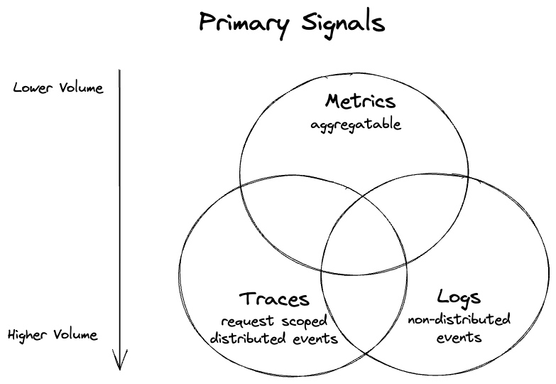

> Figure 1 显示了帮助对工作负载进行观察的三个主要信号。请注意，并非所有的度量都是语义可聚合的，但它们通常可以更容易地进行聚合（或代表一组事件本身）。较低的体积刻度也指的是典型的体积——你可以使用度量产生过多的数据，但比使用日志和跟踪更难一些。

所有信号在被收集或进行工具化方面都有不同的方法。它们在获取、存储和分析方面具有不同的资源成本，同时提供了观察同一系统的不同方式。在它们之间或选择它们的问题上存在一种权衡的游戏，就像工程中的所有其他任务一样。在接下来的部分，我们将通过深入研究每个信号来帮助你做出决策，从人们最喜欢的度量、日志和跟踪开始，然后是两个新兴的信号：应用程序概要和崩溃转储。

### Metrics(度量)

度量是数据的数值表示形式，对于可观测性至关重要。它们分为两个主要类别：已经是数值数据和被蒸馏（聚合）成数字的数据。前者的例子是温度，后者的例子是在Web服务器上观察到的HTTP请求的计数器。

数字是存储数据的最有效方式，所有成熟的行业随着时间的推移都趋向于首先采用度量。例如，您的租金、水费、暖气、冷却和电费都是仅包含度量的，您用于支付它们的银行账户也是仅包含度量的。

让我们看一个度量的典型用例示例——测量主机（例如虚拟机）的堆内存使用情况的仪表。让我们称之为“heap-memory-bytes”。该度量由名称、一组标签（有时称为属性或标签）和每个时间点的数值（例如，每秒一个值）组成。每个具有特定名称和标签的度量实例通常被称为“时间序列”或“流”。

“heap-memory-bytes”将允许我们随时间查看每个主机的堆内存使用情况。我们还可以在其上执行其他聚合，例如每个数据中心的平均堆内存使用量。

| 度量名称       | 标签键 | 标签值 | 标签键   | 标签值 | 时间点 t0 的值 | .. 到 t1 的值 |
|-------------------|-----------|-------------|-------------|-------------|------------------|----------|
| heap-memory-bytes | host      | host123     | data-center | c1          | 11231            | 11200    |
| heap-memory-bytes | host      | host234     | data-center | c1          | 300203           | 412103   |

> 表1显示了一个示例度量的两个时间序列。它们的度量名称、标签和在特定时间戳处的值以列的形式呈现。

精馏数据丢失了一些细节。度量表示系统状态的时间点观察，这意味着在观察的时间间隔（t0和t1之间）内，我们不知道堆值。我们也不能回答比主机更详细的问题，例如使用了哪些进程ID以及有多少堆字节。这与专注于具有更多详细信息的单个事件的记录或跟踪的日志不同（例如，“进程A在主机B上分配了20字节”）。

如果按照预期使用（参见[基数问题](#metric-cardinality)），这种权衡使得度量成为“已知未知”中最有效的信号之一：

* 就可预测的处理成本而言，度量在保留、发射、传输和存储方面都非常高效，因为体积不会随着流量增加而增加。例如，无论有多少分配或进程正在运行，每个主机上始终只有一个“heap-memory-bytes”度量）。
* 具有清晰维度的较小数据量还会减轻人类操作员的心理负担，因为他们可以快速了解情况的概览（例如，发生内存饱和时）。

行业还发现了对于不同观察有用的不同类型的度量。各种数据模型描述了多种类型，但我们可以概述三种通常受支持的核心类型：

* Gauge(计量表): 表示可以任意上下移动的单个数值。计量表通常用于测量温度或当前内存使用率等测量值，但也可以用于可以上下移动的“计数”，例如并发请求的数量。
* Counter(计数器): 表示具有单个单调递增计数器的累积度量。计数器的值只能在重新启动时增加或重置为零。计数器可以表示已服务的请求数，已完成的任务数或错误数。
* Histogram(直方图): 对观察值（例如，请求持续时间或响应大小）进行采样，并在可配置或指数桶中对其进行计数。它还提供了所有观察值的总和。允许对分布式观察的高级分析，如百分位数和热力图。

度量通常是结构化或半结构化的，并且通常以两种方式使用：

* __实时监控和警报__ - 度量的最常见用例是查看和深入研究可视化仪表板。它还用于触发监视的系统已经越过阈值或行为异常的警报或通知，无论是人为还是自动化系统。
* __趋势和分析__ - 度量还用于随时间的趋势分析和长期规划，同时还提供在发生事故后深入了解修复和监控潜在问题以防止再次发生的见解。

度量提供的信息用于形成对系统整体行为和健康状况的洞察。度量通常在“发生了什么”以及有时在“为什么”方面发挥着重要作用。例如，度量可以告诉您每秒的HTTP请求次数，但并不总是可以解释请求出现高峰或下降的原因。但它可以告诉您为什么负载均衡器过载（例如，请求过多导致CPU飙升）。

换句话说，度量并不总是揭示根本原因，但它们提供了一个高层次的概述和寻找问题根本原因的起点。调查的下一步可能涉及查看[相关信息](#correlating-observability-signals)，例如其他相关的度量（例如，查找较高延迟的根本原因，我们可以检查服务器的温度），跟踪，日志——来回跳跃相当常见。

在CNCF生态系统中，我们看到两种受欢迎的度量数据模型：[Prometheus](https://prometheus.io/docs/concepts/data_model/)和[OpenTelemetry (metrics)](https://opentelemetry.io/docs/specs/otel/metrics/data-model/)。

#### Metrics 基数

关于你的工作负载收集的度量的一个重要特征是它们的[基数](https://www.robustperception.io/cardinality-is-key/)。通常，对于度量，基数表示在一定时间内收集的唯一度量系列的数量。表1表示了t0-t1期间的基数为2。然而，如果我们有100个数据中心，每个中心有10,000台主机，那么在相同的持续时间内，我们可能会产生1百万个度量系列（基数为1,000,000）。

虽然1百万这个数字对于单个度量名称来说似乎很大，但它可以轻松适应单个节点数据库。例如，Prometheus可以扩展到数千万个活动系列。与表示每个内存分配的日志或跟踪事件的数量相比，它的处理成本也要低得多。

每个高效的度量存储后端或供应商都会随着度量基数的增加而扩展，即真正的成本会随着基数的增加而增加。鉴于度量的典型间隔在1秒到1分钟之间变化，样本数量也可能代表某个持续时间的基数。这就是为什么你会看到一些供应商和系统按样本计费的原因。许多系统还对特定时间内基数的大小有一定的限制。

基数有多大才算太大？没有一个单一的数字，因为它取决于你的需求以及你愿意为度量花费多少钱。当你需要支付更多（或必须扩展度量存储），而昂贵的维度（具有许多唯一值的维度）的价格标签对你来说不够有价值时，基数可能太大。

例如，假设我们想要扩展我们的“heap-memory-bytes”以跟踪每个应用程序的内存。第一个想法是向我们的表示进程ID的度量中添加一个“PID”标签。

| 度量名称       | 标签键 | 标签值 | 标签键 | 标签值 | 标签键   | 标签值 | 时间点 t0 的值 | ... 到 t1 的值 |
|-------------------|-----------|-------------|-----------|-------------|-------------|-------------|------------------|----------|
| heap-memory-bytes | host      | host123     | PID       | 22          | data-center | c1          | 3445             | 3445     |
| heap-memory-bytes | host      | host123     | PID       | 24          | data-center | c1          | 231              | 190      |
| heap-memory-bytes | host      | host123     | PID       | 44          | data-center | c1          | 51331            | 22340    |
| …                 |           |             |           |             |             |             |                  |          |
| heap-memory-bytes | host      | host234     | PID       | 34          | data-center | c1          | 300203           | 412103   |
| …                 |           |             |           |             |             |             |                  |          |

> 表2 显示了一个带有额外、潜在危险的PID标签的示例度量的多个时间序列。

这个度量实现进入了一个灰色区域，因为这种度量的基数可能实际上是不受限制的（在64位系统中可能有大约4百万个PID，并且每次应用程序重新启动都可能使用一个新的唯一PID）。假设我们在每个区域平均托管了100个应用程序，每个应用程序有三个副本，持续一天。在这种情况下，PID标签可能会使我们单个度量的基数潜在地达到数十亿。

在我们的例子中，由于我们对某些应用程序副本使用的内存感兴趣，只要我们能够识别特定的应用程序，我们就不需要PID。如果我们能够通过某个ID（例如在Kubernetes中的pod名称）识别一个副本，我们可以用“副本ID”代替“PID标签”，将度量的基数最大降低到“heap-memory-bytes”的3亿个系列（通常更少）。如果我们进一步删除主机标签（我们是否关心应用程序副本在哪个主机上使用了多少内存？），我们可以将基数（从而降低成本）减少到只有30000个，即300（所有副本的数量）* 100（数据中心的数量）！

添加“PID”标签具有潜在的无限基数的可能性，但这完全取决于你的基础设施特性。这可能是一个值得付费的决定，但它也可能是一个意外的度量基数爆炸（导致可扩展性问题或成本飙升的出人意料的系列数量）。

度量基数通常被称为度量的致命弱点。这可能是误导性的，因为每一条可观察性数据都有其成本。度量的效率来自于随时间稳定的维度及其值。

高基数问题通常发生是因为用户试图过度使用便宜且高效的度量存储和管道来处理具有非度量特性的可观察性数据。如果最终结果是高度唯一的标签（高基数），导致度量具有短暂的系列（少数样本），那么我们应该考虑发出事件（日志、跟踪或概要文件），而不是度量样本。

### Logs(日志)

日志是一个或多个文本条目，描述操作系统、应用程序、服务器或其他设备中的使用模式、活动和操作。

日志可以分为不同的类别，例如：
* __应用程序日志__ - 在应用程序内部发生事件时创建应用程序日志。这些日志帮助开发人员了解和衡量应用程序在开发过程中和发布后的行为。
* __安全日志__ - 安全日志是对系统中的安全事件做出响应时创建的。这些事件可能包括各种事件，如登录失败、密码更改、身份验证请求失败、资源访问、资源更改（包括文件、设备、用户或其他管理更改）。系统管理员通常可以配置安全日志中包含哪些事件。
* __系统日志__ - 系统日志记录操作系统内部的事件，例如处理物理和逻辑设备的内核级消息、引导序列、用户或应用程序身份验证以及其他活动，包括故障和状态消息。
* __审计日志__ - 也称为审计跟踪，本质上是事件和更改的记录。通常，它们通过记录谁执行了某个活动、执行了什么活动以及系统如何响应来捕捉事件。系统管理员通常会根据业务需求确定对审计日志收集什么。
* __基础设施日志__ - 是基础设施管理的重要组成部分，涉及管理影响组织IT基础设施的物理和逻辑设备。这可以是在本地或在云中进行，可以通过API、Syslog或使用基于主机的代理收集。

日志在不同的情景下都很有用 - 用于派生度量或跟踪，进行安全审计，或用于调试。保留所有与应用程序和系统相关的事件记录可以使我们了解甚至重现导致特定情况发生的步骤。这些记录在进行根本原因分析时非常有价值，提供了在失败时了解应用程序或系统状态的信息。

存储在日志中的信息是自由形式的文本，这使得从中推导含义变得具有挑战性。在过去的30年里，已经尝试过为日志应用模式，但它们尚未取得特别成功。模式的原因在于，它可以更轻松地提取相关信息。通常，这是通过解析、分割和分析日志文件中的文本来完成的。日志数据也可以转换为其他可观测信号，包括度量和跟踪。一旦数据成为度量，就可以用于了解随时间的变化。日志数据也可以通过日志分析技术进行可视化和分析。

日志级别允许表示每个日志语句的重要性。其中一组这样的日志级别是ERROR、WARNING、INFO和DEBUG。其中，ERROR是最不详细的级别，而DEBUG是最详细的级别。
1. __ERROR__ 用于传达故障发生的原因和详细信息。
2. __WARNING__ 是一个需要注意的高级别消息，尽管不是故障。
3. __INFO__ 消息帮助我们了解系统的工作方式。
4. __DEBUG__ 是存储每个操作详细信息的级别。通常仅在故障排除期间或由于存储或性能影响而短暂使用。

使用多个详细程度级别生成详细信息以帮助进行故障排除和根本原因分析。

日志可以通过多种方式转发。第一个建议是配置标准流以将日志直接发送到中央位置。其次，将日志写入消息队列，以在到达最终目的地之前进行过滤或丰富。最后一种方法使用开源数据收集应用程序将日志发送到中央存储库。将日志与其他可观测信号结合使用，以完整地查看系统。

在规划日志解决方案时，安全性是我们必须考虑的问题。对于静止时和传输时发送的日志相关文件或信息进行加密。不要在任何日志中存储任何个人身份信息（PII）。最后，真正重要的数据不应仅保存在日志中，尽管日志语句很有用，但不能保证它们会被传送。

### Traces(追踪)

分布式跟踪是一种了解分布式事务（例如由最终用户启动的请求及其在所有下游微服务和数据存储中的影响）的技术。

跟踪通常是“跟踪数据点”或正常情况下称为跨度的树，可以被可视化为如下例子中的甘特图：

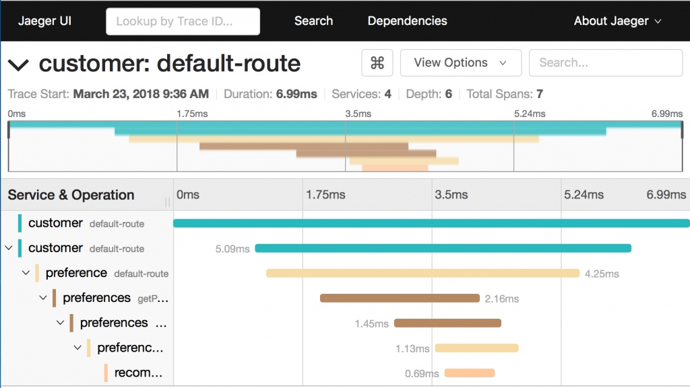

> Image 1 显示Jaeger项目UI，用于可视化给定跟踪的跨度。

跟踪通常表示一个具体的事务实例，即计算机通过特定程序的路径，使其成为一种详细且因此昂贵的可观测信号。跨度具有高度的上下文性。除其他事项外，跨度记录有关启动它的“父”跨度的信息。这使得可以在分布式系统的不同组件之间建立因果关系，例如服务、队列、数据库等。

在不同组件之间持久保存关系的关键机制是上下文传播。虽然许多监控系统实现了它们自己专有的跟踪上下文传播方式，但行业已经达成一致，即跟踪上下文传播应该标准化。这导致W3C分布式跟踪工作组的创建，随后发布了W3C Trace Context规范。W3C Trace Context定义了用于传播上下文信息以启用分布式跟踪场景的标准HTTP标头和值格式。该规范标准化了上下文信息在服务之间的发送和修改方式。上下文信息在分布式系统中唯一标识个别请求，并定义了一种添加和传播提供程序特定上下文信息的方法。

今天，像 [OpenTelemetry](https://opentelemetry.io/) 这样的项目或像.NET这样的平台使用W3C Trace Context作为它们的标准传播格式。示例，附加到日志和Prometheus度量的跟踪和跨度ID，也遵循相同的格式。更多云原生项目正在追随这条路线，在没有其他设计目标的情况下，建议使用W3C标准。一旦云基础架构提供商支持它，上下文在通过服务网关等托管服务时就不会中断。

仪表是所有可观测信号的重要组成部分，但鉴于其复杂性，它在分布式跟踪中起着至关重要的作用。仪表创建数据点并从服务到服务传播上下文。没有上下文传播，我们无法将传入的HTTP请求与其下游的HTTP请求或消息生产者与其消费者链接起来。

对于分布式跟踪，仪表有两个主要目的：上下文传播和跨度映射。在大多数情况下，上下文传播是通过可以与HTTP客户端和服务器集成的库来透明完成的。在这方面，可以使用OpenTelemetry APIs/SDK等项目、工具和技术，等等。

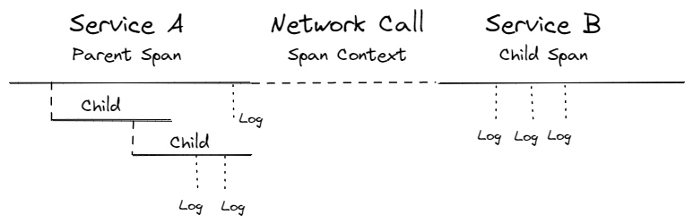
> Figure 2 显示了网络调用中跨度关系。

### Profiles

随着公司继续优化云原生应用程序，理解性能指标在尽可能细粒度的水平上变得越来越重要。其他工具通常会显示存在性能问题（即延迟、内存泄漏等）。持续收集Profiles允许我们深入挖掘，看看为什么特定系统会遇到这些问题。

有几种不同的Profiles可用于其他用例/资源：
* CPU Profilers
* Heap Profilers
* GPU Profilers
* Mutex profilers
* IO profilers
* 特定语言 profilers (例如 Go pprof、JVM 概要文件生成器，以及目前正在添加到 Java 的 pprof 支持)

在每种Profiles中，都有许多子类型的概要文件，它们都共享着解析系统中资源分配方式的相同目标。

传统上，由于在系统中获得这种级别的可见性所涉及的开销较大，Profiles被认为不适合在生产环境中运行。然而，由于采样Profiles的流行，它们在云环境中变得越来越受欢迎；它们只会增加少量的开销，使得在生产环境中生成概要文件成为可行的选项。

在Profiles生成数据中添加一个“时间”轴，将静态概要文件的粒度和洞察力与从细粒度和鸟瞰角度检查数据的能力结合在一起。全面了解资源在系统中的分配变得越来越重要，这在优化/调试云原生应用程序并规划如何分配资源时至关重要。

与追踪扩展您了解应用程序的哪个部分负责延迟问题的选项类似，概要文件生成允许您进一步深入，了解延迟问题存在的原因。此外，它还帮助您了解代码的哪些部分使用了最多的服务器资源。

运行时生成的概要文件通常包含到行号的统计信息，因此它们是从“什么”直接到代码“为什么”方面的极好数据。

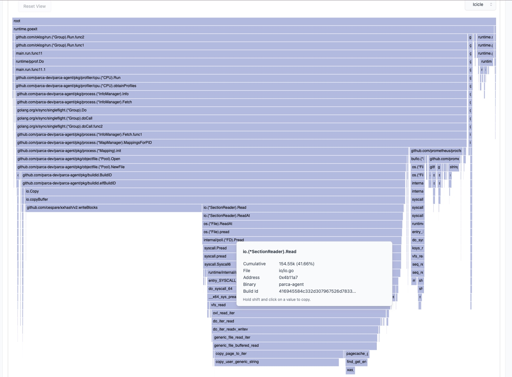

> Image 2 显示了一个由 Go 编写的应用程序的 CPU 概要文件的示例悬浮图。它包括由 Syscall 调用执行的内核操作。该概要文件突出显示了 35% 的 CPU 时间用于计算哈希，表明存在潜在的优化机会。[Source](https://pprof.me/9ce2c2d/)。

### Dumps(崩溃转储)

在软件开发中，核心转储文件用于排除程序崩溃的问题。经典地，操作系统通过一些配置（例如位置、命名约定或文件大小）在崩溃时写入进程内存的图像以进行分析。然而，在云原生中，大型集群的核心转储文件收集可能会在存储或甚至网络方面轻松创建瓶颈，具体取决于集群存储如何连接到集群节点。例如，处理密集型应用程序可能会生成几十吉字节大小的核心转储文件。

在基于 Linux 的系统中，核心转储文件可以通过全局设置（/proc/sys/kernel/core_pattern）写入任何位置。从内核 2.6+ 开始，引入了一种处理核心转储的新方法，称为核心转储处理程序。换句话说，与其委托给操作系统收集文件，崩溃进程的输出被推送到应用程序的标准输入，后者负责写入文件。例如，在基于 Debian 的发行版中，可以使用 systemd 或 abort 的支持来完成此操作。基于 RedHat 的发行版使用所谓的 ABRT。

截至今天，云原生社区在收集核心转储方面仍然需要帮助。我们至少想要强调两个主要原因：与应用程序开发人员可以访问所有旋钮来配置命名约定、大小或文件收集位置的系统相比，在云原生中，应用程序和基础架构所有者的角色不太清晰，因此对全局系统设置的（特权）访问不太容易。此外，数据持久性是云原生环境固有的：崩溃的应用程序（例如，一个 pod）需要帮助收集其核心转储文件，以便在重新启动之前写入持久卷。

大约六年前，有一份 RFC（https://lore.kernel.org/patchwork/patch/643798/）在 Linux 内核社区中请求支持命名空间核心模式，而不是将其作为全局系统设置。此外，Docker 社区也有一个相同年龄的问题（https://github.com/moby/moby/issues/19289），要求 Docker 支持核心模式。

## 关联可观测信号

毫无疑问，可观测空间是复杂的。正如您从前面的部分中了解到的，为了更多地了解我们运行的软件的状态和行为，我们收集不同类型、不同角度、不同间隔和管道的不同数据类型：Metrics、Logging、Trace、Profiles和Dumps。

首先浮现的问题是，为什么我们要创建这么多类型？难道我们不能只有一个“包罗万象”的东西吗？问题在于我们不能。就像我们不能拥有一辆既在沥青路上又在越野路上高效运行的自行车一样。每种类型的信号都是为其目的而专门设计的。__Metrics__ 以可靠且廉价的方式监控和分析规模 —— 这是可靠系统的基础。我们收集能够为我们提供有关正在运行的系统的更多细节的 __log lines__。在某个时候，这些细节形成了一个请求树，因此 __distributed tracing__  出现了，具有其跨进程上下文传播和跨服务之间的关系。有时，我们必须深入了解，进入 __performance application profiles__，查看哪些代码片段效率低下且使用了意外数量的资源。捕获 __core dumps__ 提供了有关应用程序崩溃的有价值的见解。

只有一个信号很少足以构成一个完整、方便的可观察性故事。例如，将过多的细节放入 __metrics__（基数）可能会太昂贵，而 __trace__ 每个可能的操作的可靠追踪也太昂贵，以满足警报所需的准实时延迟。这就是为什么许多组织的目标是安装并利用其可观察性故事的多个信号。

在构建多信号可观察性故事时需要克服一些挑战。除非选择较大的供应商，否则您可能需要为每个可观察性信号使用单独的系统。这是由于每种信号的不同性能特征和使用模式，需要不同的存储系统和可能其他的安装方法。

此外，鉴于我们可能拥有四种或更多的可观察性信号，我们的可观察性系统的用户可能需要相当大的学习曲线，以了解四个或更多不同的 UI 和用于检索每种信号的 API。如果用户只熟悉指标和日志，很常见看到用户试图采取捷径，很少使用追踪或概要文件。

与其将每种可观察性信号保留在各自的隔间中，不如找到一种允许在不同信号之间实现无缝过渡的方法。在本节中，我们将深入研究信号相关性以及它们如何有助于可观察性使用体验。

**建议**: 所有这些可能都有点难以理解。如果您需要决定从何入手，可以从您已经拥有的东西开始。在任何云原生或网络环境中，您可能可以从指标和在更传统的设置中使用的日志开始。努力使指标变得合理，并然后扩展到其他信号类型。这可能既具有最短的价值实现时间，又具有最佳的成本效益。

### 信号相关性

有两种基本的方法来关联数据：通过自己构建关联，或者利用已经存在的数据。

每当可能时，应该为所有的可观测信号使用相同的元数据结构。例如，如果你正在使用 Kubernetes 或 Prometheus，你已经在为你的指标使用标签。在能做到的情况下，在日志中也使用相同的标签。

如果你不得不自己构建，让我们看看所有信号附加的常见数据：

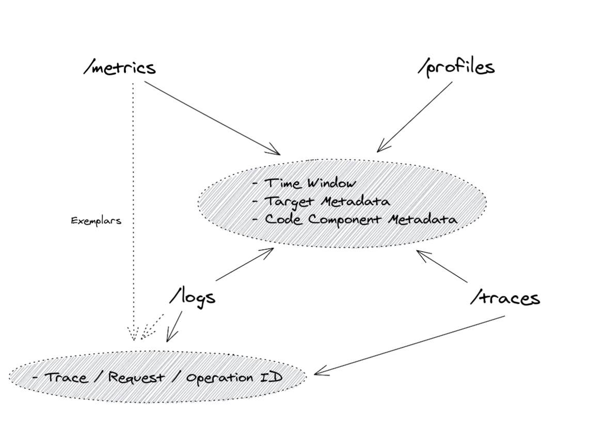

> Figure 3 显示了四个可观测信号之间的共同关联。

由于对所有可观测信号的持续收集，每个数据片段都是针对某个时间戳进行范围的。这允许我们将数据过滤为在 __某个时间窗口__ 内的信号，有时可以达到毫秒级。在上图所示的不同维度上，每个可观测信号通常与某个“目标”相关联。要识别目标，必须存在 __目标元数据__ ，这理论上允许我们从目标看到与度量、概要文件、追踪和日志行相关的内容。为了进一步缩小范围，向所有信号添加有关可观测数据所收集的 __代码组件__ 的额外元数据，例如“factory”，并不罕见。

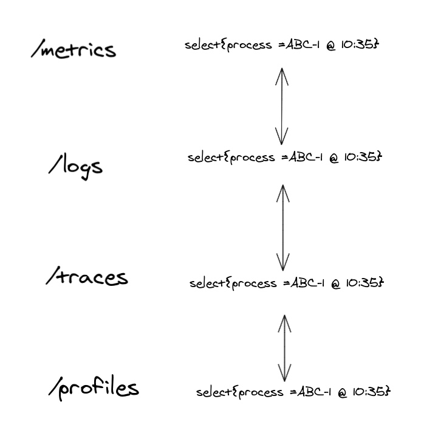

> Figure 4 展示了如何使用一致的目标元数据在不同的可观测信号之间进行跳转。

仅仅图4中的流程就相当强大，因为它允许我们通过选择与某个流程或代码组件和时间相关的每个信号中的项，快速导航到每个信号。考虑到这一点，一些前端工具，如 Grafana，已经允许创建这样的链接和侧面视图。

但这并不是结束。有时我们可能有进一步的细节，有时附加到追踪和日志记录中。分布式追踪之所以强大，是因为将所有跨足的跨度都绑定到单一的 __trace ID__ 之下。这些信息会从函数传播到函数，从进程传播到进程，以链接同一用户请求的操作。在你的日志行中共享与请求相关的相同信息是很常见的，有时称为 __Request ID__ 或 __Operation ID__。通过确保日志记录和追踪之间的这些 ID 是相同的简单技巧，我们在这种低级别范围上强烈关联了彼此。这使我们能够轻松地在日志行和追踪跨度之间导航，并与与单个请求相关的标签绑定。

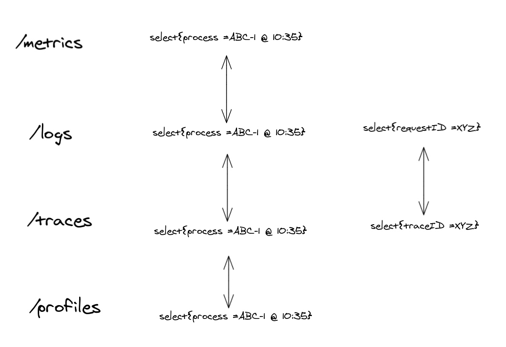

> Figure 5 展示了如何使用请求或操作 ID 在日志和追踪之间进行跳转。

虽然这种程度的关联对于某些用例可能足够好，但我们可能忽略了一个重要的用例：大规模！在这样的大型系统中，进程不处理几个请求。它们执行数万亿的操作，用于各种目的和效果。即使我们可以获取来自单个进程的所有日志行或追踪，即使是一秒钟，那么在处理数千个并发请求时，您如何找到与您的目标相关的请求、操作或追踪 ID 呢？强大的日志语言（例如 [LogQL](https://grafana.com/docs/loki/latest/logql/)）允许您为详细信息（如日志级别、错误状态、消息、代码文件等）搜索日志。然而，这要求您了解可用字段、它们的格式以及它们如何映射到情况。

如果警报高错误数量或某个端点的高延迟能让您知道所有受影响的请求 ID，那不是更好吗？这样的警报可能基于 __metrics__，而这样的指标在某个请求流程中被增加，这很可能还产生了 __log line or trace__，并分配了其 __request, operation or trace ID__，对吗？

这听起来很棒，但正如我们所知，这样的聚合数据，比如度量或将多个请求的结果结合在一起的某些日志行，是有设计目的的（惊喜！）。出于成本和关注的原因，我们不能传递所有（有时是数千个）requests ID，但关于这些请求，我们可以利用的一个有用的事实是，它们在这样的聚合度量(aggregated metric)或日志行(logline)的上下文中都是相等的！因此，可能没有必要保留所有 ID。我们只需附加一个代表一个示例情况的 ID。这就是我们所谓的 __典型值__。

> [Exemplar](https://dictionary.cambridge.org/dictionary/english/exemplar): a typical or good example of something.

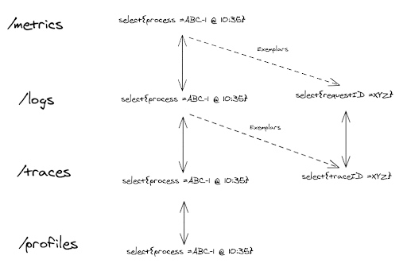

> Figure 6 展示了使用目标元数据、请求或操作 ID 或典型值的所有可能链接。

我们可以在完美的可观测系统中混合使用所有的链接，从而在多个信号或视角中灵活地检查我们的系统。

理论上，我们也可以将典型值附加到性能概要文件上。然而，考虑到性能概要文件的专业化和用例（在进程内性能调试中），我们很少需要将单个概要文件链接到单个请求或操作，然后为我们提供日志行的追踪。

### 实际应用

我们讨论了在信号之间导航的方法，但这有用吗？让我们简要地通过两个基本示例：

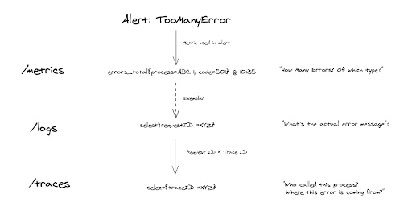

> Figure 7 展示了一个故障排除示例，从警报开始利用平稳的可观测性关联。

* 我们收到了一个有关意外高错误率的警报，超出了我们的 SLO。警报基于错误计数，我们看到请求中出现了501错误的激增。我们使用 示例值 导航到示例日志行，以了解确切的用户友好错误消息。看起来错误来自一个在许多跳跃之后的内部微服务，因此我们通过存在匹配 __request ID__ 的 __trace ID__ 导航到跟踪。由于这一点，我们确切地知道哪个service/process负责问题，并深入挖掘。

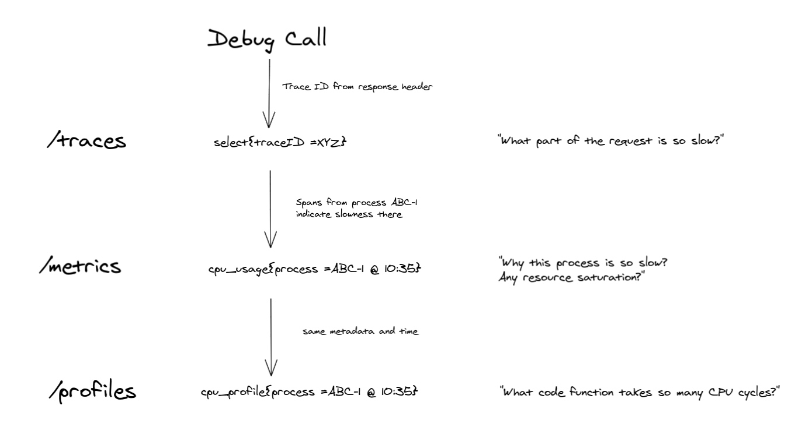

> Figure 8 展示了另一个示例故障排除故事，从跟踪开始利用目标元数据关联。

* 我们调试慢请求。我们手动触发了带有跟踪采样的请求，并获得了 __trace ID__。通过跟踪视图，我们可以看到在请求途中的几个进程中，一个名为 ABC-1 的请求在基本操作中出奇地慢。借助目标元数据和时间，我们选择相关的 CPU 使用率指标。我们看到高的 CPU 使用率，接近机器极限，表明 CPU 饱和。要了解为什么 CPU 使用如此之高（特别是如果它是容器中唯一的进程），我们通过相同的 __target metadata__ 和 __time__ 选择导航到 CPU profile。

### 实际实现

富有关联的多信号可观测性仍在发展中。如果您或您使用的项目只实现了其中一方面，不要担心。本节将指导您完成一些语义约定，以链接典型系统中的信号。您有主观看法的系统可能会有更多的链接。
让我们对确保图 3 和图 6 中提到的链接所需的项目进行迭代：

1. 所有信号都附有一致的 __目标__ 元数据。

我们需要一致的元数据来在来自相同目标的可观测信号之间切换（例如，相同应用程序）。这可能意味着利用基于拉的系统，如 Prometheus 或 OpenTelemetry Prometheus 接收器（度量标准）、日志尾采集器（OpenTelemetry、Fluentd、Fluentbit 等）并确保由您的采集器或代理附加了一组一致的目标标签或属性，例如 "cluster"、"environment"、"pod" 和 "container_name"。在处理基于推送的集合时，比如 [OTLP](https://opentelemetry.io/docs/specs/otel/protocol/) （metrics, logs and tracing），通常是由已被仪表化的应用程序附加目标信息，从而确保一致性。

2. 考虑使操作 ID、请求 ID 或跟踪 ID 成为相同的唯一 ID，并将其附加到日志系统（不仅仅是tracing！）。

尽量将跟踪和日志客户端仪表化，以便跟踪库生成跟踪 ID（实质上表示通过不同微服务的唯一请求）。当记录与请求相关的事件时，可以将相同的跟踪 ID 附加到日志行。

3. 仪表化示例。

为了启用示例，我们通常必须更改客户端仪表化。这是因为我们必须向相关指标（例如请求延迟的直方图）注入 Trace ID（如果有效）。许多 Prometheus 客户端（例如 [Go](https://github.com/prometheus/client_golang/blob/v1.16.0/examples/exemplars/main.go)）和 [OpenTelemetry SDKs](https://opentelemetry.io/docs/specs/otel/metrics/data-model/#exemplars) 支持示例，因此只需更改相应的仪表化代码。在将来，我们可能会看到更多的库和自动仪表化解决方案，可以自动注入示例。

## 用例

让我们深入了解可观测性及其信号的更高级用法和分类。

### Box-based 监控类别

有时监控被称为能够检测已知未知数的系统，与强调能够找到和推理未知未知数的可观测性相对。

传统上，监控是系统管理员或人为运算符（运维）的关注点。软件没有以监控为目标进行开发，运维人员必须从外部信号中推断系统的状态（有时通过“激发”信号，即探测，例如使用 [blackbox exporter](https://github.com/prometheus/blackbox_exporter)）。这就是我们所说的封闭框监控。

现代方法是将监控作为开发人员的关注点，即仪表化代码成为开发过程的一部分，当然，现在监控也有助于开发过程（调试、优化）。这意味着我们必须打开软件的这个盒子（因此出现了开放盒子的名称），在这里，仪表化是提高您的可观测性质量的关键步骤。

虽然开放盒子监控需要更复杂的仪表化，但它允许从应用程序获得更准确和高效的信号。如果无法为监控需求更改应用程序，或者当要准确测量用户体验时，封闭盒子监控仍然是一个有效的选择。

### 实施 SLI、SLO 和 SLA

实施 SLI、SLO 和 SLA 指标可以让您客观地测量服务质量和客户满意度。此外，它在组织内为业务、产品和工程等不同职能提供了一组共同的术语。在任何组织中，工程时间都是一种有限的资源，但每个人都觉得他们的问题是一个紧迫的问题。SLO 使这类对话更具数据驱动性，因为每个人都了解违反 SLO 的业务后果。解决内部冲突还使您更加以客户为中心，通过提供有意义的抽象来实现有意义且可操作的警报。

在深入实施细节之前，我们应该澄清定义，因为它们可能相当混乱，有时可以互换使用。

* 服务水平指标（SLI）：SLI 是对所提供服务水平某个方面的精心定义的定量度量（通常是指标），例如某一时刻的尾延迟或错误率。
* 服务水平目标（SLO）：SLO 是您可以容忍服务失败的频率。由 SLI 测量的服务水平的目标值或值范围。SLO 通常在开始时相当严格，后来进行调整。它不仅有助于稍后制定 SLA，还有助于设定开发目标。
* 服务水平协议（SLA）：SLA 是一份业务合同，其中包括违反 SLO 或 SLO 的略微放宽版本的后果。
* 错误预算：由 SLO 决定的一段时间内失败事件的容忍度。这是在一定时间框架内 SLO 的百分比差，例如一个月。

阅读更多： [Google SRE Book](https://sre.google/sre-book/service-level-objectives/).

对于拟议的 SLO 要有用和有效，所有利益相关方都必须同意。产品经理必须同意这个阈值对用户来说足够好，低于这个值的性能是不可接受的，并值得花费工程时间来修复。产品开发人员需要同意，如果错误预算已用尽，他们将采取一些措施来降低对用户的风险，直到服务重新回到预算内。负责保卫此 SLO 的生产环境的团队必须同意，在不费力劳动、过度劳累和燃烧的情况下，这是可捍卫的，所有这些都对团队的长期健康和服务造成损害。

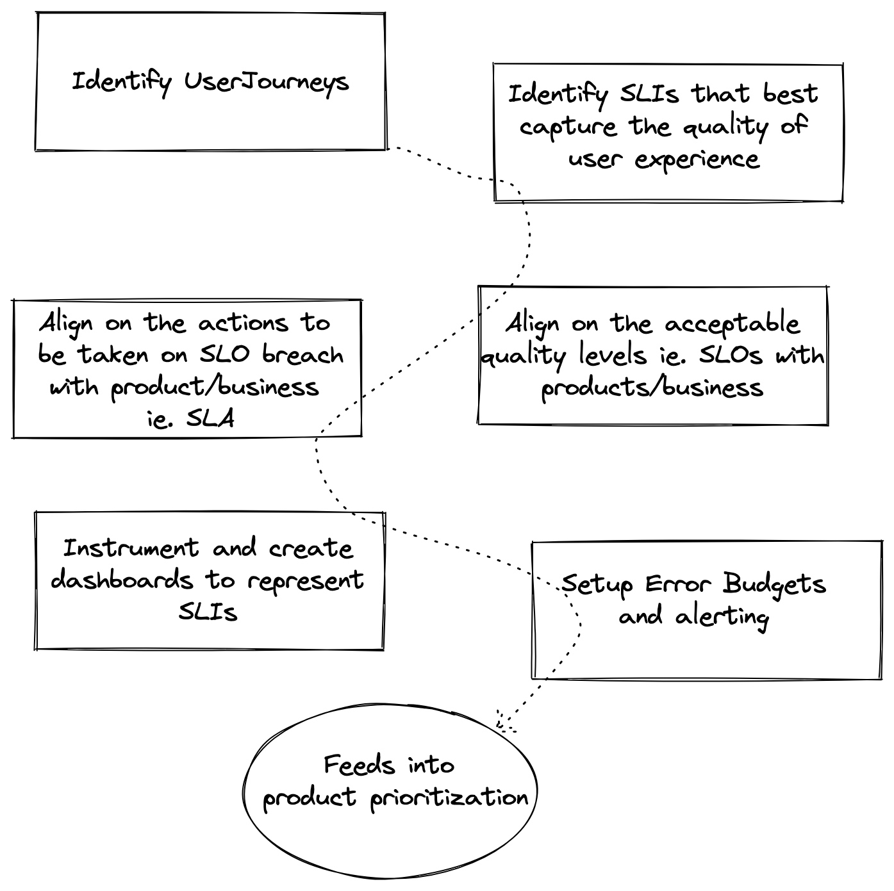

> Figure 9 展示了定义 SLI、SLO 和 SLA 所需的步骤。

### 根据可观测性数据发出警报

在可观测性数据上发出警报使用户能够检测正在监控的系统中的问题。在广泛采用度量收集之前，大多数软件系统仅依赖于日志来解决和排除问题，并获得对其系统的可见性。除了日志搜索和仪表板外，日志和探针还为许多团队和工具提供了主要的警报来源。这种方法在许多现代可观测性系统中仍然存在，但通常应避免使用，而更倾向于在时间序列度量上发出警报。具体而言，我们将探讨使用定义的 SLO 和错误预算来执行可操作警报的方法。

在您的时间序列数据中有许多信号可以发出警报，其中许多可能是特定于应用程序的。一个推荐的最佳实践是使用团队的 SLO 来驱动您的警报。如上所述，SLO 是服务水平目标，由服务水平指标测量的服务水平的目标值或值范围。例如，对于 REST API 的 SLO 可能是“95% 的请求必须在 500 毫秒内完成”。您还应该定义错误预算以获得有效的团队警报。我们将看一下如何结合 SLO 和错误预算来进行可操作的警报。

#### __告警实践__

构建警报可能非常复杂，很容易被错误的阳性所淹没，并引起警报疲劳。警报应该是可操作的，并指示有人需要采取措施解决的问题。

警报还有不同严重性——不是每个警报都同等重要，例如“传呼”和“工单”警报之间存在差异。这里的术语变化很大。有些人在特指“传呼”时说“警报”，即需要紧急人工干预，足以唤醒某人。

“工单”警报的有用性经常被低估，即那些需要最终注意但不紧急的警报（因为大规模系统中的事物总是会发生故障，并且它们被设计成在一定程度上容忍这些故障），因此它们可以成为正常工作的一部分，例如替换破损的非关键磁盘。

下面我们将介绍三种可以实施的方法，一种是较简单的方法，第二种基于燃烧率，最后一种基于 ML 模型。

##### __目标错误率__

警报目标错误率是一种常见的方法。选择一个小的时间窗口，例如 10 分钟，并在该窗口内的错误率超过您的 SLO 时发出警报。

例如，如果您的 SLO 是 99.9%，则如果过去 10 分钟内的错误率 >= 0.1%，则发出警报。在 Prometheus 中，这可能看起来像这样（总 HTTP 请求错误除以过去 10 分钟内所有请求的总和）：

```
(sum(rate(http_requests_total{code=~"5.*"}[10m])) / sum(rate(http_requests_total[10m]))) > 0.001
```

这样做的优点是在警报逻辑中很容易看到发生了什么，并且在发生错误时迅速提供警报。然而，这个警报可能会在许多不违反您定义的 SLO 的事件上触发。

##### __性能消耗速率__

性能消耗速率告警是一种更复杂的方法，可能会产生更可操作的警报。首先，让我们更详细地定义性能消耗速率和错误预算。

所有 SLO 定义中都蕴含着错误预算的概念。通过声明 SLO 为 99.9%，您是在说 .1% 的故障率（即您的错误预算）在一些预定义的时间内是可以接受的（您的 SLO 窗口）。"性能消耗速率是服务以消耗错误预算的速度的相对 SLO 的速度" [8](#references)。 因此，例如，如果“服务使用燃烧率为 1，这意味着它以一种使您在 SLO 时间窗口结束时恰好没有预算的速度消耗错误预算。对于 SLO 99.9% 在 30 天的时间窗口内，恒定的 0.1% 错误率正好使用了所有错误预算：性能消耗速率为 1" [8](#references)。

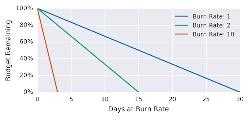

> Figure 10 显示了相对于性能消耗速率的错误。

| 性能消耗速率 | 99.9% SLO 的错误率 | time to exhaustion |
|-----------|----------------------------|--------------------|
| 1         | 0.1%                       | 30 days            |
| 2         | 0.2%                       | 15 days            |
| 10        | 1%                         | 3 days             |
| 1000      | 100%                       | 43 minutes         |

> Table 3 显示了性能消耗速率和完成预算耗尽所需的时间。

性能消耗速率将允许我们减小窗口的大小并创建一个在检测时间和精度上都很好的警报。对于我们的示例，假设将警报窗口保持固定在一个小时，并决定 5% 的错误预算开销足够显著，您可以然后推导出用于警报的性能消耗速率。

对于基于性能消耗速率的警报，警报触发所需的时间是：
```
(1 - SLO / error ratio) * alerting windows size * burn rate
```
并且在触发警报时消耗的错误预算是：
```
(burn rate * alerting window size) / time period
```
因此，在一小时内花费 30 天错误预算的 5% 需要一个性能消耗速率为 36。现在，警报规则变为：
```
(sum(rate(http_requests_total{code=~"5.*"}[1h])) / sum(rate(http_requests_total[1h]))) > 36 * .001
```

##### 异常检测

让我们在开始本节时先发出警告：在任何足够大的数据集中都会发现相关性。例如，长达近两百年，海盗数量和全球变暖呈负相关关系，直到近年来变暖急剧上升。

虽然基于阈值的警报为用户提供了根据已知值配置警报的机制，但它们可能会过于僵化，无法适应由季节性、正在进行的部署和其他情况引起的数据变化。

使用机器学习技术和统计模型有助于理解长达数月的行为模式，并使用它来确定当前观察到的样本是否异常。有几篇学术论文和开源实现可供采纳，将异常检测作为一种检测系统中的问题的机制。有关此主题的 [eBay user story](https://tech.ebayinc.com/engineering/sherlock.io-an-upgraded-machine-learning-monitoring-system)。

使用基于 ML 的动态阈值会引入复杂性。关于此类警报是否足够可靠，以便呼叫人员或进行自动修复存在争议。然而，毫无疑问，它们可以作为疑难解答的建议和提示而极具价值。

### 根本原因分析

一旦可观察性系统检测到问题，就需要能够对问题进行分类。通常，根本原因分析是通过手动或自动化技术完成的，以查看通过日志、度量和跟踪可用的各种信号，并确定问题的最可行来源。依赖基于事件图的先进技术，处理来自多个微服务的数据并为根本原因提供建议，大大缩短了对大规模分布式系统进行分类的时间。

## 可观察性领域的现有差距(Gap)

在本节中，我们探讨与需要更多工作的可观察性相关的 CNCF 生态系统中的领域。可以将这一部分视为一个令人惊奇的项目、标准、博客文章甚至业务的空间！

也许有人对其中一些问题有答案，并且可以为本白皮书做出贡献。欢迎您这样做（请参阅[贡献](#contributions)）。

我们可以在 CNCF 开源空间逐步填补这些差距。以下是其中一些：

### 开源的自动和非侵入式仪表工具

应用程序所有者通常必须修改源代码并引用不同的代理来收集可观察性信号。我们可以看到还有许多更多的信号出现。有更多解决方案的空间，这些解决方案将自动推断开放框信号并集成到收集流程中。

### 标准化的查询层

存在各种用于可观察性数据系统的领域特定语言（DSL），它们之间缺乏一致性或互操作性。可观察性是开发体验的基础性方面，提供了丰富的遥测摄取、存储和处理系统。切换到另一个供应商或工具仍然具有挑战性，因为用户通常必须编写自定义工具来迁移数据和查询。为了这样做，用户必须花费时间学习与以前的系统有非明显差异的不同可观察性系统的复杂性。OpenTelemetry（OTel）倡议使得能够在客户端兼容性和摄取方面跨开源项目/供应商进行互操作成为可能。受到 OTel 的启发，仍然需要工作来标准化数据的查询方式，并标准化用于表示数据的架构/术语。

### 更多的开源可观察性数据库

我们承认，并非所有可观察性信号都容易仅使用开源软件以及 CNCF 下的非 AGPL 软件实现。虽然我们看到了成熟的度量数据库（[Prometheus](https://prometheus.io)、[Thanos](https://thanos.io) 和 [Cortex](https://cortexmetrics.io），但在 CNCF 旗下我们还没有日志、跟踪和分析数据库。然而，在 CNCF 之外有很多不错的解决方案，其中一些具有更宽松或更严格的许可证。

### 流式 API 的监控

今天有一些非常著名的监控方法。例如，由 Brendan Gregg 描述的  [USE method](https://www.brendangregg.com/usemethod.html) 用于监控计算资源，以及由 Tom Wilkie 发明的 [RED method](https://www.weave.works/blog/the-red-method-key-metrics-for-microservices-architecture/) 用于监控基于请求的服务。

不幸的是，这两种方法在实施流式 API 方面都很困难。随着流式远程过程调用（RPC）的普及，例如 gRPC，我们必须开发一种新的或更新的方法和工具来监控这些情况。

## 引用文献

1. HARTMANN, Richard. Talk given at Fosdem (Brussels), Feb 2019. Available at: https://archive.fosdem.org/2019/schedule/event/on_observability_2019/. Accessed on: June 24, 2021.
2. SRIDHARAN, Cindy. _Distributed Systems Observability_. **Chapter 04, The Three Pillars of Observability**. 2018. Available at: https://www.oreilly.com/library/view/distributed-systems-observability/9781492033431/ch04.html. Accessed on: June 24, 2021.
3. BEYER, Betsy; JONES, Chris; MURPHY, Niall; PETOFF, Jennifer. _Site Reliability Engineering_. O'Reilly Media, 2016. Available at: https://sre.google/sre-book/table-of-contents/. Accessed on: June 24, 2021.
4. BEYER, Betsy; MURPHY, Niall; RENSIN, David; KAWAHARA, Kent; THORNE, Stephen. _The Site Reliability Workbook_. O'Reilly Media, 2018. Available at: https://sre.google/workbook/table-of-contents/. Accessed on: June 24, 2021.
5. SRIDHARAN, Cindy. _Monitoring and Observability_. Sep 5, 2017. Available at: https://copyconstruct.medium.com/monitoring-and-observability-8417d1952e1c. Accessed on: June 24, 2011.
6. MCCARTHY, Kate; FONG-JONES, Liz; FISHER, Danyel; MAHON, Deirdre; PERKINS, Rachel. _Observability Maturity: Community Research Findings Q1, 2020_. April, 2020. Available at: https://www.honeycomb.io/wp-content/uploads/2020/04/observability-maturity-report-4-3-2020-1-1.pdf. Accessed on: June 24, 2021.
7. Kalman R. E., _On the General Theory of Control Systems_, Proc. 1st Int. Cong. of IFAC, Moscow 1960 1481, Butterworth, London 1961. Available at: https://www.sciencedirect.com/science/article/pii/S1474667017700948?via%3Dihub. Accessed on: June 24, 2021.
8. Li et al., "Situation-Aware Multivariate Time Series Anomaly Detection Through Active Learning and Contrast VAE-Based Models in Large Distributed Systems," in IEEE Journal on Selected Areas in Communications, vol. 40, no. 9, pp. 2746-2765, Sept. 2022, doi: 10.1109/JSAC.2022.3191341.
9. H. Wang et al., "Groot: An Event-graph-based Approach for Root Cause Analysis in Industrial Settings," 2021 36th IEEE/ACM International Conference on Automated Software Engineering (ASE), Melbourne, Australia, 2021, pp. 419-429, doi: 10.1109/ASE51524.2021.9678708.

## 贡献者

从最初的文字编写到完成，这篇白皮书是社区的共同努力。从每两周一次的同步讨论，到在 [#tag-observability slack-channel](https://cloud-native.slack.com/archives/CTHCQKK7U) 上的异步讨论，再到多份草稿文件上的评论和建议，我们有比我们预期的要多得多的贡献者。以下是帮助我们的贡献者按字母顺序排列。

* [Alex Jones](https://github.com/AlexsJones)
* [Alois Reitbauers](https://github.com/AloisReitbauer)
* [Arthur Silva Sens](https://github.com/ArthurSens)
* [Bartłomiej Płotka](https://github.com/bwplotka)
* [Björn Rabenstein](https://github.com/beorn7)
* [Charles Pretzer](https://github.com/cpretzer)
* [Daniel Khan](https://github.com/danielkhan)
* [David Grizzanti](https://github.com/dgrizzanti)
* [Debashish Ghatak](https://github.com/wallydrag) 
* [Dominic Finn](https://github.com/dofinn)
* [Frederic Branczyk](https://github.com/brancz)  
* [Gibbs Cullen](https://github.com/gibbscullen)
* [Gil Raphaelli](https://github.com/graphaelli) 
* [Goutham Veeramachaneni](https://github.com/gouthamve) 
* [Gregor Zeitlinger](https://github.com/zeitlinger)  
* [Jaana Dogan](https://github.com/rakyll)
* [Jason Morgan](https://github.com/wmorgan)
* [Jonah Kowall](https://github.com/jkowall)
* [Juraci Paixão Kröhling](https://github.com/jpkrohling)  
* [Ken Finnigan](https://github.com/kenfinnigan)
* [Krisztian Fekete](https://github.com/krisztianfekete) 
* [Liz Fong-Jones](https://github.com/lizthegrey)  
* [Matt Young](https://github.com/halcyondude)
* [Michael Hausenblas](https://github.com/mhausenblas)  
* [Nicolas Takashi](https://github.com/nicolastakashi)
* [Rafael Natali](https://github.com/rafaelmnatali) 
* [Richard Anton](https://github.com/ranton256) 
* [RichiH "RichiH" Hartmann](https://github.com/RichiH)
* [Rob Skillington](https://github.com/robskillington)
* [Ryan Perry](https://github.com/Rperry2174)
* [Shelby Spees](https://github.com/shelbyspees)
* [Shobhit Srivastava]( https://github.com/SinisterLight)
* [Simone Ferlin](https://github.com/sferlin)
* [Tim Tischler](https://github.com/tischler)
* [Vijay Samuel](https://github.com/vjsamuel)
* [Wiard van Rjj](https://github.com/wiardvanrij)  

感谢大家！

## 贡献

在本白皮书中发现了拼写错误或误导性信息吗？寻找更多信息？帮助我们完善和维护这篇白皮书！以下是你可以参与的方式：

* 查看已存在的 [GH issues marked for v1.1 version](https://github.com/cncf/tag-observability/labels/cn-o11y-whitepaper-v1.1).
* 对于想法、拼写错误和贡献，创建一个 PR 或在 [GH issue](https://github.com/cncf/tag-observability/labels/cn-o11y-whitepaper-v1.1) 中添加反馈。确保它们使用美式英语语法。最好通过 [Grammarly](https://www.grammarly.com/)（免费版本也可以）或类似工具进行检查。确保心中有明确的信息目标，了解想要分享什么，专注于完全开源的工具，并避免非常短的章节（如果可能的话，请尝试与现有章节整合）。
* 欢迎加入我们的  [TAG Observability Meetings or Slack](https://github.com/cncf/tag-observability/#how-we-communicate) 分享反馈和问题！
